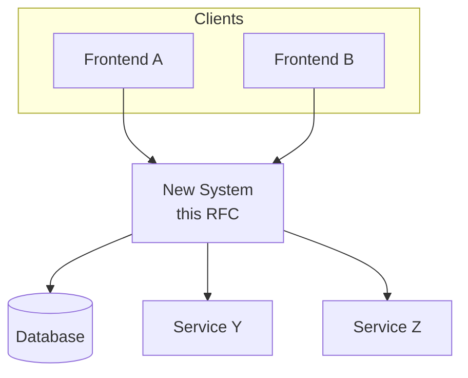

# RFC Template

Copy and fill in this template for new RFCs.

---

# [Title of RFC]

| Field | Value |
|-------|-------|
| Status | Draft |
| Author(s) | Name (email) |
| Updated | YYYY-MM-DD |
| GitHub Issue | (link, if applicable) |
| Sponsor | (optional) |
| Obsoletes | (RFC it replaces, if any) |

## Objective

[2-3 sentence summary of what you're proposing and why.]

**Goals:**

- [Concrete, measurable goal]
- [Another goal]

**Non-goals:** (things that could reasonably be goals but are explicitly out of scope)

- [Explicit non-goal and brief rationale]

## Motivation

[Why is this problem worth solving? Include:]

- Background context
- Who is affected
- Current limitations or pain points
- Supporting data or evidence

## User Benefit

[How will users benefit? What would the headline be in release notes?]

## Design Proposal

### System Context

[Diagram showing how this system fits into the larger technical landscape.]



[Adapt the diagram to show your actual system boundaries and dependencies.]

### Overview

[High-level description of the approach]

### Key Design Decisions

[Focus on trade-offs: given the context and goals, why does this solution best satisfy them?]

### API / Interface Changes

[If applicable, sketch the new or modified interfaces. Focus on design-relevant parts, not verbose definitions.]

```
// Example code or pseudocode
```

### Data Storage

[If applicable, how and where data is stored]

### Usage Examples

[Show how the feature would be used in practice]

## Alternatives Considered

### Alternative 1: [Name]

[Description]

**Pros:** [advantages]

**Cons:** [disadvantages]

**Why not chosen:** [reasoning]

### Alternative 2: [Name]

[Description]

**Pros:** [advantages]

**Cons:** [disadvantages]

**Why not chosen:** [reasoning]

## Dependencies

- **New dependencies:** [List any new libraries, services, or external dependencies]
- **Dependent projects:** [Projects that rely on or are affected by this change]

## Engineering Impact

- **Maintenance:** [Who will own and maintain this code?]
- **Testing:** [How will this be tested? What coverage is expected?]
- **Build impact:** [Any changes to build process or artifacts?]
- **API surface:** [Changes to public API surface area]

## Platforms and Environments

- **Platform compatibility:** [Does this work across all supported platforms?]
- **Execution environments:** [Simulators, production, specific hardware, etc.]

## Best Practices

[Does this change recommended practices? How will changes be communicated?]

## Tutorials and Examples

[Plans for documentation, tutorials, or example code]

## User Impact

- **User-facing changes:** [What changes will users see?]
- **Migration:** [Any migration steps required?]

## Deprecation Plan

[If replacing existing functionality, how will the old code be deprecated?]

## Detailed Design

[Optional: Technical deep-dive for complex proposals. Can reference separate documents.]

## Questions and Discussion Topics

1. [Open question for reviewers]
2. [Another open question]
3. [Areas where feedback is especially needed]

---

## Revision History

| Date | Author | Changes |
|------|--------|---------|
| YYYY-MM-DD | Name | Initial draft |
