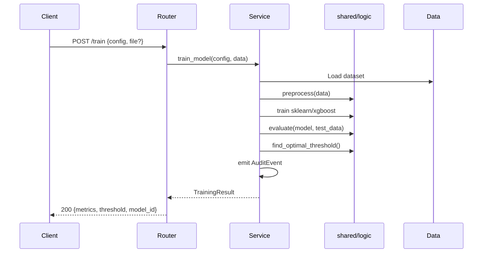

# RFC-002: FastAPI Service Layer

| Field | Value |
|-------|-------|
| Status | Implemented |
| Author(s) | [Your Name] |
| Updated | 2026-02-01 |
| Depends On | RFC-001 |

## Objective

Build FastAPI service in `apps/api/` that exposes training and prediction endpoints, consuming schemas and logic from `shared/`.

**Goals:**

- RESTful endpoints for train, predict, model management
- Ephemeral training (session-scoped, returns metrics)
- Optional model persistence with serve instructions
- Structured logging and audit events
- OpenAPI documentation auto-generated

**Non-goals:**

- Authentication (Phase 5)
- Distributed model serving
- WebSocket streaming

## Motivation

With `shared/` complete, we need an API layer so that:

- Gradio and Next.js UIs can call a single backend
- Marimo notebooks can optionally use API instead of direct logic calls
- External systems can integrate via REST
- Audit trail captures all operations

## User Benefit

**Release notes:** "Train and compare credit risk models via API. Get predictions programmatically."

## Design Proposal

### Directory Structure

```
apps/api/
├── main.py                 # App factory, CORS, lifespan
├── config.py               # Settings via pydantic-settings
├── dependencies.py         # Request-scoped dependencies
├── routers/
│   ├── __init__.py
│   ├── train.py            # POST /train
│   ├── predict.py          # POST /predict
│   └── models.py           # GET/POST /models
├── services/
│   ├── __init__.py
│   ├── training.py         # Training orchestration
│   ├── inference.py        # Prediction logic
│   └── audit.py            # Audit event emission
└── tests/
    ├── conftest.py
    ├── test_train.py
    └── test_predict.py
```

### Endpoints

| Method | Path | Request | Response | Description |
|--------|------|---------|----------|-------------|
| `POST` | `/train` | `TrainingConfig` + file | `TrainingResult` | Train model, return metrics |
| `POST` | `/predict` | `PredictionRequest` | `PredictionResponse` | Run inference |
| `GET` | `/models` | — | `list[ModelSummary]` | List session models |
| `POST` | `/models/{id}/persist` | — | `PersistResponse` | Save artifact |
| `GET` | `/health` | — | `{"status": "ok"}` | Health check |

### Training Flow



### Configuration

```python
# apps/api/config.py
from pydantic_settings import BaseSettings

class Settings(BaseSettings):
    app_name: str = "Credit Risk API"
    debug: bool = False
    default_dataset_path: str = "data/raw/cr_loan_w2.csv"
    model_artifacts_path: str = "artifacts/"
    log_level: str = "INFO"

    class Config:
        env_prefix = "CREDIT_RISK_"
```

### Dependencies

```python
# apps/api/dependencies.py
from functools import lru_cache
from .config import Settings

@lru_cache
def get_settings() -> Settings:
    return Settings()
```

### Model Storage

For Phase 2, models are stored in-memory per session:

```python
# In-memory store (replaced with persistence in Phase 5)
_model_store: dict[str, Any] = {}

def store_model(model_id: str, model: Any, metadata: dict) -> None:
    _model_store[model_id] = {"model": model, "metadata": metadata}

def get_model(model_id: str) -> Any:
    return _model_store.get(model_id)
```

### Audit Logging

```python
# apps/api/services/audit.py
import json
import logging
from shared.schemas.audit import AuditEvent

logger = logging.getLogger("audit")

def emit_event(event: AuditEvent) -> None:
    logger.info(json.dumps(event.model_dump(), default=str))
```

## Alternatives Considered

### Alternative 1: GraphQL

**Pros:** Flexible queries, single endpoint

**Cons:** Overkill for this use case, steeper learning curve

**Why not chosen:** REST is simpler and sufficient for CRUD + train/predict

### Alternative 2: gRPC

**Pros:** Fast, typed contracts, streaming support

**Cons:** Browser support requires proxy, harder to debug

**Why not chosen:** REST better for web UIs and broader compatibility

### Alternative 3: Serverless Functions

**Pros:** Auto-scaling, pay-per-use

**Cons:** Cold starts hurt training latency, complex local dev

**Why not chosen:** Training requires warm instances; monolith simpler for now

## Dependencies

**New dependencies:**

- `fastapi` — Web framework
- `uvicorn` — ASGI server
- `pydantic-settings` — Configuration management
- `python-multipart` — File upload support

**From shared/:**

- All schemas from `shared/schemas/`
- All logic from `shared/logic/`

## Engineering Impact

**Maintenance:** API layer owned by backend team

**Testing:**

- Integration tests using `TestClient`
- Mock shared/logic for unit tests where needed
- Target: 80%+ coverage on routers and services

**Build impact:**

- New `apps/api/` package
- Add to uv workspace

**API surface:**

- Public REST API at `/train`, `/predict`, `/models`, `/health`
- OpenAPI spec auto-generated at `/docs`

## Platforms and Environments

| Environment | Config | Notes |
|-------------|--------|-------|
| Local | `uv run uvicorn` | Hot reload enabled |
| Docker | `Dockerfile` in apps/api/ | For deployment |
| Production | Any cloud | Containerized |

## Best Practices

- All request/response models from `shared/schemas/`
- Services contain business logic, routers are thin
- Audit events for all mutating operations
- Structured JSON logging

## Tutorials and Examples

After implementation:

- OpenAPI docs at `/docs`
- Example curl commands in README
- Postman collection (optional)

## User Impact

**User-facing changes:**

- New API available for programmatic access
- Can train models without UI

**Migration:**

- No migration needed (new functionality)

## Questions and Discussion Topics

### 1. File uploads — multipart form or base64 in JSON body?

**Decision: Multipart form upload.**

- The training endpoint currently reads from a server-side CSV path (`settings.default_dataset_path`). When user-supplied datasets are needed, use `UploadFile` (multipart form) rather than base64 in JSON.
- Multipart is the standard for file uploads in REST APIs — it streams data without inflating payload size (~33% overhead with base64), works natively with browser forms and `curl`, and FastAPI has first-class `UploadFile` support with automatic temp file handling.
- Base64 would only make sense if datasets were always tiny and embedding them in JSON simplified a specific client. That's not the case here — credit risk CSVs can be tens of MB.
- Implementation: add an optional `file: UploadFile | None` parameter to `POST /train`. When provided, write to a temp path and pass that to `train_model()`. When absent, fall back to `settings.default_dataset_path`. This is a backward-compatible change.

### 2. Model storage — in-memory dict sufficient for Phase 2?

**Decision: Yes, in-memory is sufficient for Phase 2. Migrate in Phase 5.**

- The current `_model_store` dict in `model_store.py` is session-scoped and intentionally ephemeral. This is appropriate because Phase 2 is a demo/validation layer — models are trained, evaluated, and optionally persisted to disk via `POST /models/{id}/persist`.
- The `persist` endpoint already handles durable storage (pickle + JSON metadata to `artifacts/`). Users who need to keep models across sessions use that endpoint.
- Phase 5 should replace the in-memory store with a proper registry (filesystem index or MLflow) that supports loading previously persisted models at startup.
- No changes needed now. The `model_store.py` comment already documents this plan.

### 3. CORS origins — allow all (`*`) for dev, what for prod?

**Decision: `*` for dev/demo (current). Explicit allowlist for any real deployment.**

- Current `cors_origins: list[str] = ["*"]` in `config.py` is fine for local dev and internal demos where Gradio/Next.js frontends run on different ports.
- For production or any internet-facing deployment, set `CREDIT_RISK_CORS_ORIGINS` environment variable to an explicit list (e.g., `["https://app.example.com", "https://demo.example.com"]`). The `pydantic-settings` env var binding already supports this — no code changes needed.
- Do **not** ship `*` to production. A wide-open CORS policy allows any website to make authenticated requests on behalf of a user's browser session. Even without auth today, it's a bad habit to carry forward.
- Phase 3 (when auth is added) should enforce this as a deployment check.

### 4. Rate limiting — needed for public API?

**Decision: Not needed for Phase 2. Add in Phase 3+ if the API becomes public.**

- Phase 2 is internal/demo use only. The training endpoint is inherently slow (seconds to train sklearn models), which is a natural throttle. Adding rate limiting now would be premature complexity.
- If the API becomes public-facing or is deployed behind a shared gateway, rate limiting should be added at the infrastructure level (e.g., API gateway, reverse proxy like nginx/Caddy) rather than in application code. This keeps the FastAPI layer focused on business logic.
- If application-level limiting is needed later, `slowapi` (built on `limits`) integrates cleanly with FastAPI and can be added in a single middleware registration.

---

## Revision History

| Date | Author | Changes |
|------|--------|---------|
| 2025-01-31 | — | Initial draft |
| 2026-02-01 | Claude | Update status to Accepted, all open questions resolved |
