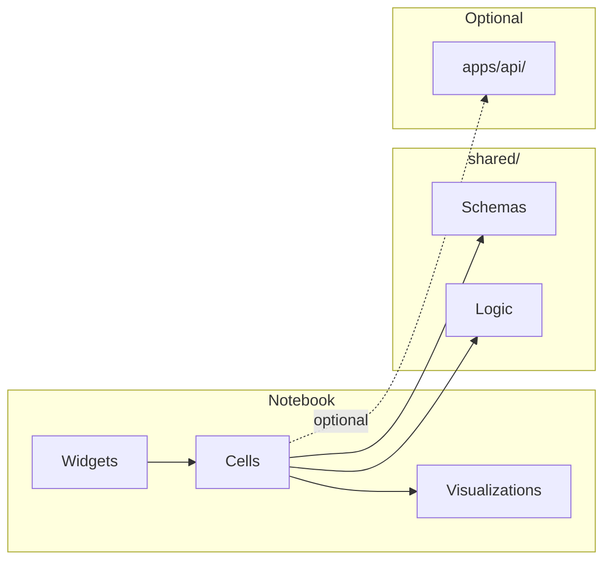

# RFC-003: Marimo Interactive Notebooks

| Field | Value |
|-------|-------|
| Status | Draft |
| Author(s) | [Your Name] |
| Updated | 2025-01-31 |
| Depends On | RFC-001, RFC-002 |

## Objective

Create interactive Marimo notebooks in `notebooks/` for exploratory data analysis and model comparison, importing from `shared/` and optionally calling `apps/api/`.

**Goals:**
- Interactive model training and comparison
- Threshold optimization visualization (Youden's J)
- ROC curves, calibration plots, confusion matrices
- Deployable to Molab for mobile/cloud access
- Exportable to `.ipynb` for Colab users

**Non-goals:**
- Production model serving (that's the API)
- Replacing the Next.js UI
- Complex multi-user workflows

## Motivation

With `shared/` and `apps/api/` complete, we need an interactive exploration layer for:
- Developers iterating on model logic
- Stakeholders understanding model behavior
- Educational demonstrations of credit risk concepts
- Quick prototyping before UI implementation

**Why Marimo over Jupyter:**
- `.py` files = clean git diffs
- Reactive cells = no stale state
- Built-in widgets = no ipywidgets complexity
- Molab deployment = share without infrastructure

## User Benefit

**Release notes:** "Explore credit risk models interactively. Compare algorithms, tune thresholds, visualize performance—all in your browser or mobile device."

## Design Proposal

### Directory Structure

```
notebooks/
├── 01_eda.py                     # Exploratory data analysis
├── 02_model_comparison.py        # Train and compare models
├── 03_threshold_optimization.py  # Youden's J walkthrough
├── 04_calibration.py             # Calibration curves
└── README.md                     # Usage instructions
```

### Notebook Specifications

#### 01_eda.py — Exploratory Data Analysis

**Purpose:** Understand the dataset before modeling

**Sections:**
1. Dataset overview (shape, dtypes, missing values)
2. Target distribution (default rate, class imbalance)
3. Numeric feature distributions (histograms)
4. Categorical feature distributions (bar charts)
5. Correlation analysis
6. Feature-target relationships

**Widgets:**
- Dataset selector (default or upload)
- Feature selector for detailed view

---

#### 02_model_comparison.py — Model Training & Comparison

**Purpose:** Train multiple models and compare performance

**Sections:**
1. Configuration panel (model types, test size, random state)
2. Training execution
3. Metrics comparison table
4. ROC curve overlay (all models)
5. Feature importance comparison

**Widgets:**
- Model type multiselect (logistic, xgboost, random_forest)
- Test size slider (0.1 - 0.5)
- Random state input
- Train button

**Integration:**
- Option A: Direct `shared/logic/` calls (faster, offline)
- Option B: API calls to `apps/api/` (validates API works)
- Toggle between modes

---

#### 03_threshold_optimization.py — Youden's J Walkthrough

**Purpose:** Teach threshold selection interactively

**Sections:**
1. What is a classification threshold?
2. Sensitivity vs Specificity tradeoff
3. Youden's J statistic explanation
4. Interactive threshold slider
5. Confusion matrix at selected threshold
6. Business impact calculator (cost of FP vs FN)

**Widgets:**
- Threshold slider (0.0 - 1.0)
- Cost inputs (false positive cost, false negative cost)
- Model selector (from trained models)

---

#### 04_calibration.py — Probability Calibration

**Purpose:** Assess and improve probability estimates

**Sections:**
1. What is calibration?
2. Calibration curve visualization
3. Brier score comparison
4. Calibration methods (Platt, Isotonic)
5. Before/after calibration comparison

**Widgets:**
- Model selector
- Calibration method selector
- Number of bins slider

### Code Patterns

#### Import Convention

```python
import marimo as mo
import numpy as np
import plotly.express as px
import plotly.graph_objects as go

# Import from shared — NEVER duplicate logic
from shared.schemas.loan import LoanApplication, LoanDataset
from shared.schemas.training import TrainingConfig, TrainingResult
from shared.schemas.metrics import ModelMetrics, ThresholdResult
from shared.logic.threshold import find_optimal_threshold
from shared.logic.evaluation import compute_roc_curve, compute_calibration_curve
from shared.logic.preprocessing import encode_categoricals
from shared.constants import NUMERIC_FEATURES, CATEGORICAL_FEATURES
```

#### Widget Pattern

```python
# Marimo cell with widget
threshold_slider = mo.ui.slider(
    start=0.0,
    stop=1.0,
    step=0.01,
    value=0.5,
    label="Classification Threshold"
)

mo.md(f"Selected threshold: **{threshold_slider.value}**")
```

#### Reactive Pattern

```python
# Cell that reacts to widget changes
@mo.cell
def update_confusion_matrix():
    threshold = threshold_slider.value
    predictions = (probabilities >= threshold).astype(int)
    cm = confusion_matrix(y_true, predictions)
    return plot_confusion_matrix(cm)
```

### Visualization Library

Use **Plotly** for all charts:
- Interactive (zoom, hover, pan)
- Consistent with potential Next.js usage (Plotly.js)
- Good Marimo integration

### Data Flow



### Molab Deployment

Each notebook should be deployable standalone:

```bash
# Local
marimo run notebooks/02_model_comparison.py

# Molab (cloud)
# Upload .py file directly to Molab
```

Requirements for Molab compatibility:
- No local file paths (use upload widgets or bundled data)
- All dependencies in standard Marimo environment
- No subprocess calls

## Alternatives Considered

### Alternative 1: Jupyter + Voila

**Pros:** Familiar, large ecosystem

**Cons:** `.ipynb` diffs are noise, stale cell state, complex deployment

**Why not chosen:** Marimo offers better DX and cleaner git history

### Alternative 2: Streamlit (keep existing)

**Pros:** Already built, familiar

**Cons:** Not reactive, poor code organization, deprecated APIs

**Why not chosen:** Migration goal is to move away from Streamlit

### Alternative 3: Panel/HoloViz

**Pros:** Powerful dashboards

**Cons:** Steeper learning curve, heavier framework

**Why not chosen:** Marimo is simpler for notebook-style exploration

## Dependencies

**New dependencies:**
- `marimo` — Notebook framework
- `plotly` — Visualization (already likely in project)

**From shared/:**
- All schemas from `shared/schemas/`
- All logic from `shared/logic/`

## Engineering Impact

**Maintenance:** Notebooks owned by ML/data team

**Testing:**
- Notebooks are primarily interactive — no unit tests
- Smoke test: `marimo run <notebook>` should launch without errors
- Logic tested via `shared/` tests

**Build impact:**
- Add `marimo` to dev dependencies
- No build step for notebooks

## Platforms and Environments

| Environment | Command | Notes |
|-------------|---------|-------|
| Local | `marimo run notebooks/01_eda.py` | Hot reload |
| Local edit | `marimo edit notebooks/01_eda.py` | Cell editor |
| Molab | Upload `.py` file | Cloud/mobile |
| Colab | Export to `.ipynb` | `marimo export` |

## Best Practices

- **Never duplicate logic** — always import from `shared/`
- **One concept per notebook** — keep focused
- **Progressive disclosure** — simple first, advanced options hidden
- **Descriptive markdown** — explain what each section does
- **Consistent styling** — same color palette across notebooks

## Questions and Discussion Topics

1. **Data loading** — Bundle `cr_loan_w2.csv` or require upload?
2. **API integration** — Include API call option or keep notebooks offline-only?
3. **Chart theme** — Match future Next.js theme or Marimo defaults?
4. **Molab limits** — Any compute/memory constraints to design around?

---

## Revision History

| Date | Author | Changes |
|------|--------|---------|
| 2025-01-31 | — | Initial draft |
