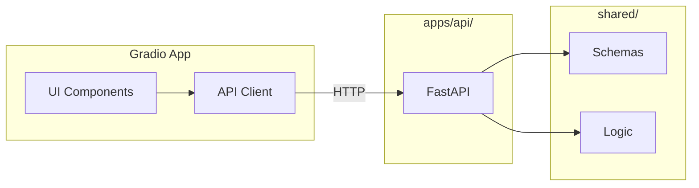

# RFC-004: Gradio Stakeholder Demo App

| Field | Value |
|-------|-------|
| Status | Draft |
| Author(s) | [Your Name] |
| Updated | 2025-01-31 |
| Depends On | RFC-001, RFC-002 |

## Objective

Build a Gradio app in `apps/gradio/` for stakeholder demos, calling `apps/api/` for all model operations.

**Goals:**

- Quick stakeholder demos without full UI
- Validate UX patterns before Next.js build
- Deployable to Hugging Face Spaces
- Zero logic duplication (API calls only)

**Non-goals:**

- Production-grade UI polish
- Authentication
- Complex state management

## Motivation

With `shared/` and `apps/api/` complete, we need a validation layer:

- Faster to build than Next.js
- Stakeholders can interact before full UI is ready
- HF Spaces deployment = shareable link, no infrastructure
- Validates API contract works end-to-end

**Position in UI progression:**

```
Marimo (explore) → Gradio (validate) → Next.js (ship)
```

## User Benefit

**Release notes:** "Demo credit risk models instantly via web interface. Train, predict, and compare—no setup required."

## Design Proposal

### Directory Structure

```
apps/gradio/
├── app.py                    # Main Gradio app
├── components/
│   ├── __init__.py
│   ├── training_tab.py       # Model training UI
│   ├── prediction_tab.py     # Single prediction UI
│   └── comparison_tab.py     # Model comparison charts
├── api_client.py             # Typed API wrapper
├── config.py                 # API URL, settings
├── requirements.txt          # Minimal deps for HF Spaces
└── README.md                 # Deployment instructions
```

### App Structure

Three-tab interface:

```
┌─────────────────────────────────────────────────────┐
│  [Train]    [Predict]    [Compare]                  │
├─────────────────────────────────────────────────────┤
│                                                     │
│              Tab Content Area                       │
│                                                     │
└─────────────────────────────────────────────────────┘
```

### Tab Specifications

#### Tab 1: Train

**Purpose:** Train a model and view results

**Components:**

- Model type dropdown (logistic_regression, xgboost, random_forest)
- Test size slider (0.1 - 0.5)
- Dataset selector (default or file upload)
- Train button
- Results display:
  - Metrics table (accuracy, precision, recall, F1, ROC-AUC)
  - Optimal threshold
  - Training time

**API Call:** `POST /train`

---

#### Tab 2: Predict

**Purpose:** Get prediction for a single loan application

**Components:**

- Input form with all loan fields:
  - person_age (number)
  - person_income (number)
  - person_emp_length (number)
  - loan_amnt (number)
  - loan_int_rate (number)
  - loan_percent_income (number)
  - cb_person_cred_hist_length (number)
  - person_home_ownership (dropdown)
  - loan_intent (dropdown)
  - loan_grade (dropdown)
  - cb_person_default_on_file (dropdown)
- Model selector (from trained models)
- Predict button
- Results display:
  - Prediction (Default / No Default)
  - Probability
  - Threshold used

**API Call:** `POST /predict`

---

#### Tab 3: Compare

**Purpose:** Compare multiple trained models

**Components:**

- Model multiselect (from trained models)
- Comparison charts:
  - ROC curves overlay
  - Metrics bar chart
  - Threshold comparison table
- Refresh button

**API Call:** `GET /models` + stored training results

### API Client

```python
# apps/gradio/api_client.py
import httpx
from typing import Any

class CreditRiskAPI:
    def __init__(self, base_url: str = "http://localhost:8000"):
        self.base_url = base_url
        self.client = httpx.Client(timeout=60.0)  # Training can be slow
    
    def train(self, config: dict) -> dict:
        response = self.client.post(f"{self.base_url}/train", json=config)
        response.raise_for_status()
        return response.json()
    
    def predict(self, request: dict) -> dict:
        response = self.client.post(f"{self.base_url}/predict", json=request)
        response.raise_for_status()
        return response.json()
    
    def list_models(self) -> list[dict]:
        response = self.client.get(f"{self.base_url}/models")
        response.raise_for_status()
        return response.json()
    
    def health(self) -> bool:
        try:
            response = self.client.get(f"{self.base_url}/health")
            return response.status_code == 200
        except Exception:
            return False
```

### Configuration

```python
# apps/gradio/config.py
import os

API_BASE_URL = os.getenv("CREDIT_RISK_API_URL", "http://localhost:8000")
APP_TITLE = "Credit Risk Model Demo"
```

### Data Flow



### HF Spaces Deployment

`requirements.txt`:

```
gradio>=4.0.0
httpx>=0.25.0
plotly>=5.0.0
```

`README.md` (HF Spaces format):

```yaml
---
title: Credit Risk Model Demo
emoji: 📊
colorFrom: blue
colorTo: green
sdk: gradio
sdk_version: 4.0.0
app_file: app.py
pinned: false
---
```

**Deployment requires:**

1. API hosted somewhere accessible (or bundled)
2. Environment variable for API URL

**Option A:** API hosted separately (Render, Railway, etc.)
**Option B:** Bundle API in same Space (more complex)

## Alternatives Considered

### Alternative 1: Streamlit

**Pros:** Already familiar from original app

**Cons:** Moving away from Streamlit is the goal

**Why not chosen:** Gradio is lighter, better HF integration

### Alternative 2: Skip to Next.js

**Pros:** One less layer to maintain

**Cons:** Slower iteration, can't validate UX quickly

**Why not chosen:** Gradio validates API contract and UX before investing in Next.js

### Alternative 3: Panel/Voila

**Pros:** More powerful dashboards

**Cons:** Heavier, less HF Spaces support

**Why not chosen:** Gradio is simpler and well-supported on HF

## Dependencies

**New dependencies:**

- `gradio>=4.0.0` — UI framework
- `httpx>=0.25.0` — Async HTTP client
- `plotly>=5.0.0` — Charts (consistent with notebooks)

**External:**

- Running `apps/api/` instance

## Engineering Impact

**Maintenance:** Owned by frontend/demo team

**Testing:**

- Manual testing primary (UI interactions)
- Optional: Gradio's `gr.test()` for component tests
- API client can have unit tests with mocked responses

**Build impact:**

- Separate `requirements.txt` for lean HF deployment
- Does not need full monorepo deps

## Platforms and Environments

| Environment | Setup | Notes |
|-------------|-------|-------|
| Local | `gradio app.py` | API must be running |
| HF Spaces | Push to HF repo | Set API_URL env var |
| Docker | Dockerfile | Bundle with API optional |

## Best Practices

- **No logic in Gradio** — all model operations via API
- **Graceful degradation** — show clear error if API unreachable
- **Loading states** — training can take time, show progress
- **Input validation** — validate before API call to save round-trip

## Questions and Discussion Topics

1. **API hosting** — Where to host API for HF Spaces demo?
2. **Offline mode** — Support direct `shared/` calls if API unavailable?
3. **State persistence** — Remember trained models across page refresh?
4. **Theming** — Custom theme or Gradio defaults?

---

## Revision History

| Date | Author | Changes |
|------|--------|---------|
| 2025-01-31 | — | Initial draft |
