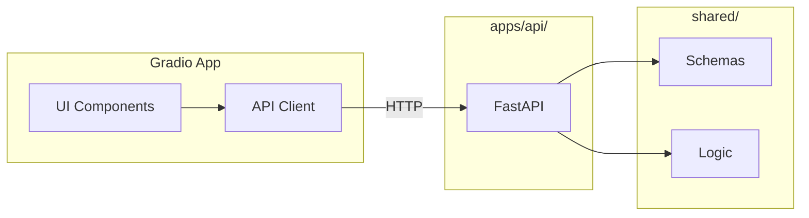

# RFC-004: Gradio Stakeholder Demo App

| Field | Value |
|-------|-------|
| Status | Accepted |
| Author(s) | [Your Name] |
| Updated | 2026-02-01 |
| Depends On | RFC-001, RFC-002 |

## Objective

Build a Gradio app in `apps/gradio/` for stakeholder demos, calling `apps/api/` for all model operations.

**Goals:**

- Quick stakeholder demos without full UI
- Validate UX patterns before Next.js build
- Deployable to Hugging Face Spaces
- Zero logic duplication (API calls only)

**Non-goals:**

- Production-grade UI polish
- Authentication
- Complex state management

## Motivation

With `shared/` and `apps/api/` complete, we need a validation layer:

- Faster to build than Next.js
- Stakeholders can interact before full UI is ready
- HF Spaces deployment = shareable link, no infrastructure
- Validates API contract works end-to-end

**Position in UI progression:**

```
Marimo (explore) → Gradio (validate) → Next.js (ship)
```

## User Benefit

**Release notes:** "Demo credit risk models instantly via web interface. Train, predict, and compare—no setup required."

## Design Proposal

### Directory Structure

```
apps/gradio/
├── app.py                    # Main Gradio app
├── components/
│   ├── __init__.py
│   ├── training_tab.py       # Model training UI
│   ├── prediction_tab.py     # Single prediction UI
│   └── comparison_tab.py     # Model comparison charts
├── api_client.py             # Typed API wrapper
├── config.py                 # API URL, settings
├── requirements.txt          # Minimal deps for HF Spaces
└── README.md                 # Deployment instructions
```

### App Structure

Three-tab interface:

```
┌─────────────────────────────────────────────────────┐
│  [Train]    [Predict]    [Compare]                  │
├─────────────────────────────────────────────────────┤
│                                                     │
│              Tab Content Area                       │
│                                                     │
└─────────────────────────────────────────────────────┘
```

### Tab Specifications

#### Tab 1: Train

**Purpose:** Train a model and view results

**Components:**

- Model type dropdown (logistic_regression, xgboost, random_forest)
- Test size slider (0.1 - 0.5)
- ~~Dataset selector (default or file upload)~~ — **Removed.** The demo always
  uses the default dataset (`data/processed/cr_loan_w2.csv`) via the API.
  Custom dataset upload would require file-handling in both the Gradio app
  and the API, adding complexity without stakeholder benefit — the demo's
  purpose is to validate model behavior on the canonical dataset.
- Train button
- Results display:
  - Metrics table (accuracy, precision, recall, F1, ROC-AUC)
  - Optimal threshold
  - Training time

**API Call:** `POST /train`

---

#### Tab 2: Predict

**Purpose:** Get prediction for a single loan application

**Components:**

- Input form with all loan fields:
  - person_age (number)
  - person_income (number)
  - person_emp_length (number)
  - loan_amnt (number)
  - loan_int_rate (number)
  - loan_percent_income (number)
  - cb_person_cred_hist_length (number)
  - person_home_ownership (dropdown)
  - loan_intent (dropdown)
  - loan_grade (dropdown)
  - cb_person_default_on_file (dropdown)
- Model selector (from trained models)
- Predict button
- Results display:
  - Prediction (Default / No Default)
  - Probability
  - Threshold used

**API Call:** `POST /predict`

---

#### Tab 3: Compare

**Purpose:** Compare multiple trained models

**Components:**

- Model multiselect (from trained models)
- Comparison charts:
  - ROC curves overlay
  - Metrics bar chart
  - Threshold comparison table
- Refresh button

**API Call:** `GET /models` + stored training results

### API Client

```python
# apps/gradio/api_client.py
import httpx
from typing import Any

class CreditRiskAPI:
    def __init__(self, base_url: str = "http://localhost:8000"):
        self.base_url = base_url
        self.client = httpx.Client(timeout=60.0)  # Training can be slow
    
    def train(self, config: dict) -> dict:
        response = self.client.post(f"{self.base_url}/train", json=config)
        response.raise_for_status()
        return response.json()
    
    def predict(self, request: dict) -> dict:
        response = self.client.post(f"{self.base_url}/predict", json=request)
        response.raise_for_status()
        return response.json()
    
    def list_models(self) -> list[dict]:
        response = self.client.get(f"{self.base_url}/models")
        response.raise_for_status()
        return response.json()
    
    def health(self) -> bool:
        try:
            response = self.client.get(f"{self.base_url}/health")
            return response.status_code == 200
        except Exception:
            return False
```

### Configuration

```python
# apps/gradio/config.py
import os

API_BASE_URL = os.getenv("CREDIT_RISK_API_URL", "http://localhost:8000")
APP_TITLE = "Credit Risk Model Demo"
```

### Data Flow



### HF Spaces Deployment

`requirements.txt`:

```
gradio>=4.0.0
httpx>=0.25.0
plotly>=5.0.0
```

`README.md` (HF Spaces format):

```yaml
---
title: Credit Risk Model Demo
emoji: 📊
colorFrom: blue
colorTo: green
sdk: gradio
sdk_version: 4.0.0
app_file: app.py
pinned: false
---
```

**Deployment requires:**

1. API hosted somewhere accessible (or bundled)
2. Environment variable for API URL

**Option A:** API hosted separately (Render, Railway, etc.)
**Option B:** Bundle API in same Space (more complex)

## Alternatives Considered

### Alternative 1: Streamlit

**Pros:** Already familiar from original app

**Cons:** Moving away from Streamlit is the goal

**Why not chosen:** Gradio is lighter, better HF integration

### Alternative 2: Skip to Next.js

**Pros:** One less layer to maintain

**Cons:** Slower iteration, can't validate UX quickly

**Why not chosen:** Gradio validates API contract and UX before investing in Next.js

### Alternative 3: Panel/Voila

**Pros:** More powerful dashboards

**Cons:** Heavier, less HF Spaces support

**Why not chosen:** Gradio is simpler and well-supported on HF

## Dependencies

**New dependencies:**

- `gradio>=4.0.0` — UI framework
- `httpx>=0.25.0` — Async HTTP client
- `plotly>=5.0.0` — Charts (consistent with notebooks)

**External:**

- Running `apps/api/` instance

## Engineering Impact

**Maintenance:** Owned by frontend/demo team

**Testing:**

- Manual testing primary (UI interactions)
- Optional: Gradio's `gr.test()` for component tests
- API client can have unit tests with mocked responses

**Build impact:**

- Separate `requirements.txt` for lean HF deployment
- Does not need full monorepo deps

## Platforms and Environments

| Environment | Setup | Notes |
|-------------|-------|-------|
| Local | `gradio app.py` | API must be running |
| HF Spaces | Push to HF repo | Set API_URL env var |
| Docker | Dockerfile | Bundle with API optional |

## Best Practices

- **No logic in Gradio** — all model operations via API
- **Graceful degradation** — show clear error if API unreachable
- **Loading states** — training can take time, show progress
- **Input validation** — validate before API call to save round-trip

## Questions and Discussion Topics

### 1. API hosting — Where to host API for HF Spaces demo?

**Decision: Option A — API hosted separately. Defer until deployment is needed.**

- For local development and internal demos, the API runs on `localhost:8000` alongside the Gradio app. This is the current workflow and requires no infrastructure.
- For HF Spaces deployment, the API should be hosted on a separate service (Render, Railway, or similar) and the `CREDIT_RISK_API_URL` environment variable set in the Space's settings. This keeps the Gradio Space lightweight (only UI deps) and avoids bundling sklearn/xgboost in the Space image.
- Bundling API + Gradio in the same Space (Option B) is possible via a multi-process Dockerfile but adds complexity for marginal benefit. The Gradio app is a thin HTTP client — it doesn't need to share a process with the API.
- No code changes required. The `config.py` already reads `CREDIT_RISK_API_URL` from the environment with a localhost fallback.

### 2. Offline mode — Support direct `shared/` calls if API unavailable?

**Decision: No. Keep Gradio as a strict API client.**

- Introducing direct `shared/` calls into the Gradio app would violate the core design principle of zero logic duplication. The Gradio layer would need to import sklearn, numpy, and the full training pipeline — duplicating the API's orchestration logic.
- The Gradio app's purpose is to validate the API contract end-to-end. An offline bypass would undermine that purpose — if the demo works without the API, there's no proof the API works.
- When the API is unreachable, the app shows a clear health-check warning banner (checked dynamically on each page load via `app.load()`). This is the correct user experience: tell the user what's wrong and how to fix it, rather than silently degrading to a different code path.
- Notebooks (RFC-003) already provide an offline exploration path via direct `shared/logic/` imports. Users who need offline access should use Marimo notebooks.

### 3. State persistence — Remember trained models across page refresh?

**Decision: Session-scoped via `gr.State`. No cross-session persistence.**

- Training results are stored in `gr.State` (a per-session Gradio state object), isolated per user session. This was chosen during the P4 review to prevent data leakage between concurrent users on HF Spaces — the original module-level dict was shared across all users.
- Cross-session persistence would require either browser `localStorage` (Gradio doesn't support this natively) or server-side session storage (adds infrastructure). Neither is justified for a demo tool.
- Models themselves are persisted server-side in the API's in-memory store (and optionally to disk via `POST /models/{id}/persist`). The API's `GET /models` endpoint provides the model list across sessions — the comparison tab's limitation is only that it needs the full `TrainingResult` (with ROC curves) which isn't returned by the list endpoint.
- If cross-session comparison is needed in the future, the right fix is to add a `GET /models/{id}/training-result` endpoint to the API, not to persist Gradio state.

### 4. Theming — Custom theme or Gradio defaults?

**Decision: Gradio defaults. No custom theming.**

- The RFC explicitly lists "Production-grade UI polish" as a non-goal. Theming effort is better spent on the Next.js UI (RFC-001) which is the production-facing layer.
- Gradio's default theme is clean and functional for stakeholder demos. Custom theming would add CSS maintenance burden and diverge from Gradio's upgrade path (theme changes between Gradio versions would require manual fixes).
- If stakeholder feedback specifically requests visual changes, apply them as targeted CSS overrides rather than a full custom theme. Gradio supports `gr.Blocks(css=...)` for surgical tweaks.
- Color consistency with notebooks (RFC-003) is not a concern — the notebook palette (`shared/constants.py` colors) applies to Plotly charts, and the Gradio app already uses Plotly for its visualizations.

---

## Revision History

| Date | Author | Changes |
|------|--------|---------|
| 2025-01-31 | — | Initial draft |
| 2026-02-01 | Claude | Remove dataset selector, answer open questions, update status to Accepted |
