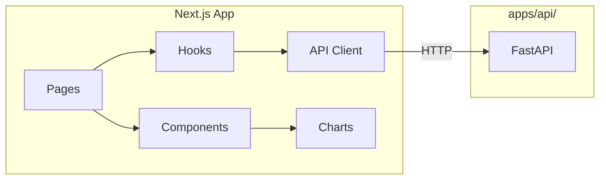

# RFC-005: Next.js Production UI

| Field | Value |
|-------|-------|
| Status | Draft |
| Author(s) | [Your Name] |
| Updated | 2025-01-31 |
| Depends On | RFC-001, RFC-002, RFC-004 |

## Objective

Build production-grade Next.js 16 app in `apps/web/` with TypeScript, calling `apps/api/` for all model operations.

**Goals:**

- Production-ready UI for end users
- TypeScript interfaces synced with Pydantic schemas
- Interactive charts (ROC, calibration, confusion matrix)
- Responsive design
- Vercel-deployable

**Non-goals:**

- Authentication (Phase 6)
- Real-time streaming
- Offline support

## Motivation

With Gradio validating UX patterns, we now build the polished production UI:

- Professional look for end users
- Type-safe frontend matching backend schemas
- Better performance than Gradio
- Full control over UX and branding

**Position in UI progression:**

```
Marimo (explore) → Gradio (validate) → Next.js (ship) ✓
```

## User Benefit

**Release notes:** "Train, compare, and deploy credit risk models with a modern web interface."

## Design Proposal

### Directory Structure

```
apps/web/
├── app/
│   ├── layout.tsx              # Root layout
│   ├── page.tsx                # Landing / dashboard
│   ├── train/
│   │   └── page.tsx            # Training page
│   ├── predict/
│   │   └── page.tsx            # Prediction page
│   ├── compare/
│   │   └── page.tsx            # Model comparison page
│   └── api/
│       └── health/
│           └── route.ts        # Optional: proxy health check
├── components/
│   ├── ui/                     # Base UI components
│   │   ├── button.tsx
│   │   ├── card.tsx
│   │   ├── input.tsx
│   │   ├── select.tsx
│   │   ├── slider.tsx
│   │   └── table.tsx
│   ├── charts/
│   │   ├── roc-curve.tsx
│   │   ├── calibration-plot.tsx
│   │   ├── confusion-matrix.tsx
│   │   └── metrics-bar.tsx
│   ├── forms/
│   │   ├── training-form.tsx
│   │   ├── prediction-form.tsx
│   │   └── loan-fields.tsx
│   └── layout/
│       ├── header.tsx
│       ├── nav.tsx
│       └── footer.tsx
├── lib/
│   ├── api-client.ts           # Typed API wrapper
│   ├── types.ts                # TypeScript interfaces (sync with Pydantic)
│   └── utils.ts                # Helpers
├── hooks/
│   ├── use-train.ts            # Training mutation hook
│   ├── use-predict.ts          # Prediction mutation hook
│   └── use-models.ts           # Models query hook
├── public/
│   └── ...                     # Static assets
├── next.config.js
├── package.json
├── tsconfig.json
└── tailwind.config.js
```

### Page Specifications

#### Landing Page (`/`)

**Purpose:** Dashboard overview and navigation

**Components:**

- Header with navigation
- Quick stats (if models exist)
- Navigation cards to Train, Predict, Compare
- API health indicator

---

#### Train Page (`/train`)

**Purpose:** Train models with configuration

**Components:**

- Training form:
  - Model type select
  - Test size slider
  - Dataset upload (optional)
  - Submit button
- Results panel (after training):
  - Metrics table
  - ROC curve chart
  - Feature importance chart
  - Optimal threshold display
- Training history list

**State:**

- Form state (react-hook-form or similar)
- Loading state during training
- Error state

---

#### Predict Page (`/predict`)

**Purpose:** Single loan prediction

**Components:**

- Loan application form (all fields)
- Model selector dropdown
- Submit button
- Result display:
  - Prediction badge (Default / No Default)
  - Probability meter
  - Threshold indicator
  - Risk explanation

**Validation:**

- Client-side validation matching Pydantic constraints
- Clear error messages per field

---

#### Compare Page (`/compare`)

**Purpose:** Compare multiple models

**Components:**

- Model multiselect
- Comparison charts:
  - ROC curves overlay
  - Metrics comparison bar chart
  - Threshold comparison table
- Export button (CSV of metrics)

### TypeScript Interfaces

```typescript
// lib/types.ts — MUST sync with shared/schemas/

export interface LoanApplication {
  person_age: number;
  person_income: number;
  person_emp_length: number;
  loan_amnt: number;
  loan_int_rate: number;
  loan_percent_income: number;
  cb_person_cred_hist_length: number;
  person_home_ownership: 'RENT' | 'OWN' | 'MORTGAGE' | 'OTHER';
  loan_intent: 'EDUCATION' | 'MEDICAL' | 'VENTURE' | 'PERSONAL' | 'DEBTCONSOLIDATION' | 'HOMEIMPROVEMENT';
  loan_grade: 'A' | 'B' | 'C' | 'D' | 'E' | 'F' | 'G';
  cb_person_default_on_file: 'Y' | 'N';
}

export interface TrainingConfig {
  model_type: 'logistic_regression' | 'xgboost' | 'random_forest';
  test_size: number;
  random_state?: number;
}

export interface ThresholdResult {
  threshold: number;
  sensitivity: number;
  specificity: number;
  youden_j: number;
}

export interface ModelMetrics {
  accuracy: number;
  precision: number;
  recall: number;
  f1_score: number;
  roc_auc: number;
  threshold_analysis: ThresholdResult;
  roc_curve: {
    fpr: number[];
    tpr: number[];
    thresholds: number[];
  };
  confusion_matrix: number[][];
}

export interface TrainingResult {
  model_id: string;
  model_type: string;
  metrics: ModelMetrics;
  optimal_threshold: number;
  feature_importance: Record<string, number> | null;
  training_time_seconds: number;
}

export interface PredictionRequest {
  applications: LoanApplication[];
  model_id?: string;
  threshold?: number;
}

export interface PredictionResponse {
  predictions: number[];
  probabilities: number[];
  threshold_used: number;
  model_id: string;
}
```

### API Client

```typescript
// lib/api-client.ts
const API_BASE_URL = process.env.NEXT_PUBLIC_API_URL || 'http://localhost:8000';

export const api = {
  async train(config: TrainingConfig): Promise<TrainingResult> {
    const res = await fetch(`${API_BASE_URL}/train`, {
      method: 'POST',
      headers: { 'Content-Type': 'application/json' },
      body: JSON.stringify(config),
    });
    if (!res.ok) throw new Error(`Training failed: ${res.statusText}`);
    return res.json();
  },

  async predict(request: PredictionRequest): Promise<PredictionResponse> {
    const res = await fetch(`${API_BASE_URL}/predict`, {
      method: 'POST',
      headers: { 'Content-Type': 'application/json' },
      body: JSON.stringify(request),
    });
    if (!res.ok) throw new Error(`Prediction failed: ${res.statusText}`);
    return res.json();
  },

  async listModels(): Promise<ModelSummary[]> {
    const res = await fetch(`${API_BASE_URL}/models`);
    if (!res.ok) throw new Error(`Failed to list models: ${res.statusText}`);
    return res.json();
  },

  async health(): Promise<boolean> {
    try {
      const res = await fetch(`${API_BASE_URL}/health`);
      return res.ok;
    } catch {
      return false;
    }
  },
};
```

### Chart Components

Use **Recharts** for charts (React-native, good TypeScript support):

```typescript
// components/charts/roc-curve.tsx
import { LineChart, Line, XAxis, YAxis, CartesianGrid, Tooltip, Legend } from 'recharts';

interface RocCurveProps {
  data: { fpr: number; tpr: number }[];
  optimalPoint?: { fpr: number; tpr: number };
}

export function RocCurve({ data, optimalPoint }: RocCurveProps) {
  return (
    <LineChart width={500} height={400} data={data}>
      <CartesianGrid strokeDasharray="3 3" />
      <XAxis dataKey="fpr" label="False Positive Rate" />
      <YAxis label="True Positive Rate" />
      <Tooltip />
      <Legend />
      <Line type="monotone" dataKey="tpr" stroke="#8884d8" dot={false} />
      {/* Diagonal reference line */}
      <Line type="monotone" data={[{fpr: 0, tpr: 0}, {fpr: 1, tpr: 1}]} stroke="#ccc" strokeDasharray="5 5" />
    </LineChart>
  );
}
```

### Styling

- **Tailwind CSS** for utility styling
- **shadcn/ui** for base components (optional)
- Consistent color palette across app
- Responsive breakpoints (mobile-first)

### Data Flow



### Environment Variables

```env
# .env.local
NEXT_PUBLIC_API_URL=http://localhost:8000
```

```env
# .env.production
NEXT_PUBLIC_API_URL=https://api.your-domain.com
```

## Alternatives Considered

### Alternative 1: React (Vite)

**Pros:** Simpler, faster builds

**Cons:** No SSR, worse SEO, manual routing

**Why not chosen:** Next.js App Router is standard for production React

### Alternative 2: Vue/Nuxt

**Pros:** Good DX, growing ecosystem

**Cons:** Team familiarity, different paradigm

**Why not chosen:** React/Next.js more common, better hiring pool

### Alternative 3: SvelteKit

**Pros:** Less boilerplate, fast

**Cons:** Smaller ecosystem, fewer components

**Why not chosen:** React ecosystem more mature

## Dependencies

**New dependencies:**

- `next@16` — Framework
- `react@19` — UI library
- `typescript` — Type safety
- `tailwindcss` — Styling
- `recharts` — Charts
- `react-hook-form` — Form handling
- `zod` — Schema validation (matches Pydantic patterns)

**Optional:**

- `shadcn/ui` — Component library
- `@tanstack/react-query` — Data fetching

## Engineering Impact

**Maintenance:** Owned by frontend team

**Testing:**

- Component tests with Vitest + Testing Library
- E2E tests with Playwright (optional)
- Type checking with `tsc --noEmit`

**Build impact:**

- `npm run build` produces static/SSR output
- Deployable to Vercel, Netlify, or any Node host

## Platforms and Environments

| Environment | Command | Notes |
|-------------|---------|-------|
| Local dev | `npm run dev` | Hot reload |
| Production build | `npm run build` | Optimized |
| Vercel | Push to repo | Auto-deploy |
| Docker | Dockerfile | Self-hosted |

## Best Practices

- **Type everything** — No `any` types
- **Sync types with Pydantic** — Update `lib/types.ts` when schemas change
- **Client-side validation** — Match Pydantic constraints with Zod
- **Loading states** — Every async action shows loading
- **Error boundaries** — Graceful error handling
- **Accessible** — ARIA labels, keyboard navigation

## Questions and Discussion Topics (Resolved)

1. **Component library** — **Decision: Custom Tailwind components.** Keeps the dependency footprint minimal. Revisit shadcn/ui if component count grows significantly.
2. **Data fetching** — **Decision: Plain fetch with typed wrapper (`lib/api-client.ts`).** Native AbortController handles timeouts. Add SWR/React Query if caching or automatic refetching becomes needed.
3. **Form library** — **Decision: Controlled components with manual validation (`lib/validation.ts`).** Validation mirrors Pydantic constraints from `shared/schemas/loan.py`. Keeps bundle size small; consider react-hook-form + zod if form complexity grows.
4. **Charts** — **Decision: Recharts 3.7.0.** React-native, good TypeScript support, lightweight. Handles all four chart types (ROC, calibration, confusion matrix, metrics bar).
5. **State management** — **Decision: Local state only (useState).** No shared cross-page state exists. Add Zustand or React context only when a concrete need arises.

### Deferred Scope

The following RFC-specified items were intentionally deferred from the initial implementation:

- `hooks/` directory (use-train, use-predict, use-models) — state is managed inline in pages
- `lib/utils.ts` helper module — no utility functions needed yet
- `app/api/health/route.ts` proxy endpoint — client calls API directly
- Export CSV button on Compare page
- Dataset upload option on Train page
- Training history list on Train page

---

## Revision History

| Date | Author | Changes |
|------|--------|---------|
| 2025-01-31 | — | Initial draft |
| 2026-02-02 | — | Resolved open questions, documented deferred scope |
