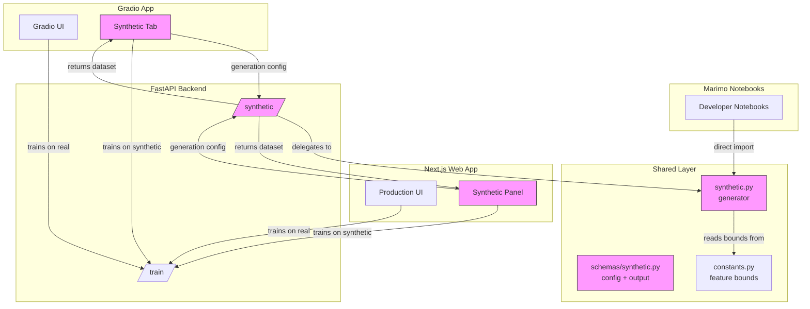

# RFC-007: Platform-Wide Synthetic Data Generation for Testing and Comparison

| Field | Value |
|-------|-------|
| Status | Implemented |
| Author(s) | pkiage |
| Updated | 2026-02-13 |
| Depends On | [RFC-001](RFC-001-CreditRiskPlatformArchitecture.md), [RFC-002](RFC-002-api-layer.md) |

## Objective

Add a platform-wide synthetic data generation capability to `shared/` that all three UI layers — Marimo, Gradio, and Next.js — can use for model testing, comparison, and exploration. Credit risk data is hard to come by and often confidential; synthetic generation removes the dependency on real datasets for development, demos, and stakeholder validation.

**Goals:**

- Provide a synthetic data generator in `shared/logic/` that produces loan application datasets matching the platform schema
- Surface synthetic data generation across all three UIs: Marimo notebooks (developer exploration), Gradio (stakeholder demos), and Next.js (production testing)
- Enable side-by-side comparison of model performance on real vs. synthetic data at every layer
- Eliminate the need for file uploads by providing controlled, on-demand data generation
- Allow the platform to be demonstrated and tested without access to real (potentially confidential) loan data

**Non-goals:**

- Building a general-purpose data generation framework (scope is credit risk loan data only)
- Replacing the real training dataset — synthetic data supplements, not supplants
- Statistical guarantees on synthetic data fidelity (e.g., differential privacy, GAN-based generation)
- Full-fidelity simulation of real-world credit portfolios (the generator targets plausible distributions, not actuarial accuracy)

## Motivation

### Credit risk data is scarce and confidential

Real-world credit risk datasets are difficult to obtain. Financial institutions treat loan-level data as highly confidential — governed by regulations (GDPR, CCPA, bank secrecy laws) and internal data governance policies. The platform currently ships a single bundled dataset (`data/processed/cr_loan_w2.csv`), but:

1. **Demos without real data** — When demonstrating the platform to prospective users or stakeholders, sharing real loan data may be impossible due to confidentiality agreements. A synthetic generator lets the platform be fully functional without exposing sensitive records.

2. **Development and testing** — Contributors and CI pipelines shouldn't depend on access to confidential datasets. Synthetic data enables meaningful integration tests, notebook development, and UI testing without real data.

3. **Limited diversity** — A single bundled dataset represents one population distribution. Models need to be tested against diverse scenarios (economic downturns, different demographic mixes, varying default rates) that a single static file cannot represent.

4. **Regulatory scrutiny** — Model validation in financial services requires testing against stressed and adversarial scenarios. Synthetic data provides a controlled, auditable mechanism for these tests.

### Why not file uploads?

Rather than asking users to source and upload their own datasets, synthetic generation is a better fit across all three UIs:

- **Marimo** — Developers can generate data programmatically in notebooks without managing CSV files. Reproducible via seed parameters.
- **Gradio** — Stakeholders get interactive controls instead of needing to prepare schema-compliant CSVs (28 columns with exact one-hot encoding conventions). No security surface from arbitrary file parsing on HF Spaces.
- **Next.js** — Production users can generate test scenarios on-demand through the web UI rather than uploading potentially confidential files over the network.

File uploads also introduce validation complexity (schema matching), security risks (CSV injection, large file DoS), and reproducibility problems (ephemeral files on HF Spaces break the audit trail).

### What synthetic data enables

Across all three UIs, synthetic data unlocks:

- **Stress testing** — Shift distributions (higher default rates, skewed income) and see how models respond
- **Sensitivity analysis** — Understand which feature ranges the model is most sensitive to
- **Real vs. synthetic comparison** — Train on both, compare side-by-side to validate model robustness
- **Onboarding** — New users and contributors can explore the full platform immediately without data access approvals
- **CI/CD testing** — Automated pipelines can generate fresh datasets for integration tests without storing sensitive data in repositories

## User Benefit

**Release notes:** "Generate synthetic loan datasets across all platform interfaces — Marimo notebooks, Gradio demos, and the Next.js web app. Explore model behavior under custom distributions, compare against real data, and demo the full platform without needing access to confidential datasets."

## Design Proposal

### System Context



Pink nodes are new components introduced by this RFC.

### Overview

The design adds components across the full platform stack:

1. **`shared/logic/synthetic.py`** — A pure-numpy synthetic data generator that produces loan datasets conforming to the existing schema. Uses `constants.py` bounds for realistic value ranges. This is the single source of truth for generation logic.

2. **`shared/schemas/synthetic.py`** — Pydantic models for generation config and output metadata.

3. **`POST /synthetic/generate`** — A new API endpoint that accepts a generation config and returns a dataset (or stores it for training). Used by Gradio and Next.js.

4. **Gradio "Synthetic Data" tab** — Interactive UI controls for distribution parameters, generation trigger, preview, and "Train on Synthetic" workflow. Targets stakeholder demos.

5. **Next.js "Synthetic Data" panel** — Production-grade UI for generating test scenarios, with the same capabilities as the Gradio tab but integrated into the web app's design system.

6. **Marimo notebook integration** — Notebooks import `generate_synthetic_dataset()` directly from `shared/logic/` for programmatic exploration, avoiding the API round-trip.

### Key Design Decisions

#### 1. Generator lives in `shared/`, not in Gradio or API

**Why:** The generator is pure business logic (numpy + schema validation). Placing it in `shared/logic/` lets Marimo notebooks and the API reuse it. This follows the existing pattern where `threshold.py`, `evaluation.py`, and `feature_selection.py` all live in `shared/logic/`.

#### 2. Parametric generation, not GAN/ML-based

**Why:** A parametric generator (controlled distributions per feature) is transparent, reproducible, and has zero additional dependencies. Stakeholders can reason about what changed ("I increased default rate to 40%") without understanding generative models. ML-based synthetic data (SDV, CTGAN) would add heavy dependencies, training time, and opacity — all non-goals for a demo tool.

#### 3. No raw CSV upload at any layer

**Why:** See Motivation. Credit risk data is confidential — accepting uploads means handling, validating, and potentially storing sensitive files across three UI layers. The API already accepts structured `TrainingConfig` objects. Synthetic data flows through the same typed pipeline — generated in-memory, validated against Pydantic schemas, and passed directly to `train_model()`. No filesystem round-trip, no confidential data transit.

#### 4. Comparison as a first-class workflow

**Why:** The primary value of synthetic data isn't training better models — it's *understanding* model behavior under conditions where real data may not be available. The design prioritizes the comparison workflow at every layer: train on real data (when available), train on synthetic data, compare metrics side-by-side. This works in Marimo (programmatic comparison), Gradio (existing Comparison tab), and Next.js (model comparison views).

#### 5. Consistent capability across all three UIs

**Why:** The UI progression (Marimo → Gradio → Next.js) means insights discovered at one layer should be reproducible at the next. If a developer finds an interesting synthetic scenario in a Marimo notebook, stakeholders should be able to reproduce it in Gradio, and production users in Next.js. All three layers share the same generator via `shared/logic/` and the same config schema via `shared/schemas/`.

### API / Interface Changes

#### New schema: `shared/schemas/synthetic.py`

```python
class SyntheticDistribution(BaseModel):
    """Per-feature distribution overrides."""
    feature: str
    mean_shift: float = 0.0       # Shift mean by this factor (1.0 = no change)
    std_scale: float = 1.0        # Scale std deviation
    # Categorical features use probability weights instead
    category_weights: dict[str, float] | None = None

class SyntheticConfig(BaseModel):
    """Configuration for synthetic dataset generation."""
    n_samples: int = Field(default=5000, ge=100, le=50000)
    default_rate: float = Field(default=0.22, ge=0.01, le=0.99)
    distributions: list[SyntheticDistribution] = []
    random_seed: int | None = 42

class SyntheticDataset(BaseModel):
    """Generated synthetic dataset metadata."""
    n_samples: int
    n_features: int
    default_rate_actual: float
    feature_names: list[str]
    summary_stats: dict[str, dict[str, float]]  # feature → {mean, std, min, max}
```

#### New endpoint: `POST /synthetic/generate`

```python
@router.post("/synthetic/generate/", response_model=SyntheticGenerateResponse)
async def generate_synthetic(config: SyntheticConfig) -> SyntheticGenerateResponse:
    """Generate a synthetic dataset and optionally train a model on it."""
    ...
```

Returns a `dataset_id` that can be referenced in subsequent `/train/` calls via a new optional `dataset_id` field on `TrainingConfig`.

#### Modified schema: `TrainingConfig`

```python
class TrainingConfig(BaseModel):
    model_type: str
    test_size: float = 0.2
    # ... existing fields ...
    dataset_id: str | None = None  # If set, train on this synthetic dataset
```

### Data Storage

Synthetic datasets are held **in-memory only** (same pattern as the existing model store). They are ephemeral by design — stakeholders generate, explore, and discard. No filesystem persistence needed.

A simple dict store keyed by `dataset_id`:

```python
# apps/api/services/synthetic_store.py
_datasets: dict[str, tuple[NDArray, NDArray, list[str]]] = {}
```

Datasets auto-expire after 1 hour or when the server restarts. A maximum of 10 datasets can be held simultaneously to bound memory usage.

### Usage Examples

#### Marimo notebook workflow (explore)

Developers import the generator directly — no API needed. Ideal for exploratory analysis when real data isn't available or can't leave a secure environment.

```python
from shared.logic.synthetic import generate_synthetic_dataset
from shared.schemas.synthetic import SyntheticConfig

# Generate a stressed scenario: high default rate, younger borrowers
config = SyntheticConfig(
    n_samples=10000,
    default_rate=0.4,
    distributions=[
        SyntheticDistribution(feature="person_age", mean_shift=-5.0),
    ],
    random_seed=42,
)
X_syn, y_syn, feature_names = generate_synthetic_dataset(config)

# Compare against real data (if available)
X_real, y_real, _ = load_dataset_from_csv("data/processed/cr_loan_w2.csv")

# Train and evaluate both — use shared/logic/evaluation.py, threshold.py
```

#### Gradio workflow (validate)

Stakeholders interact via the UI — no code, no data files needed.

1. User opens the **Synthetic Data** tab
2. Adjusts sliders: `n_samples=10000`, `default_rate=0.35`, increases `loan_int_rate` mean by 20%
3. Clicks **Generate** → sees preview table with summary statistics
4. Clicks **Train on Synthetic** → trains a logistic regression model
5. Switches to **Training** tab → trains same model type on real data
6. Opens **Comparison** tab → selects both models → sees side-by-side metrics and ROC curves

This workflow lets stakeholders demo model capabilities without ever touching real confidential data.

#### Next.js workflow (ship)

Production users generate test scenarios through the web UI, run comparisons, and export results.

1. Navigate to **Data > Synthetic Generator**
2. Configure scenario parameters or select a preset
3. Generate dataset → review summary statistics
4. Train model on synthetic data → compare against production model trained on real data
5. Export comparison report for model validation documentation

#### API workflow (shared backend)

All three UIs use the same API endpoints:

```bash
# Generate synthetic dataset
curl -X POST /synthetic/generate/ \
  -d '{"n_samples": 5000, "default_rate": 0.35}'

# Train on synthetic
curl -X POST /train/ \
  -d '{"model_type": "logistic_regression", "dataset_id": "syn_abc123"}'

# Train on real (existing behavior, unchanged)
curl -X POST /train/ \
  -d '{"model_type": "logistic_regression"}'

# Compare both
curl -X POST /models/compare/ \
  -d '{"model_ids": ["lr_real_abc", "lr_syn_def"]}'
```

## Alternatives Considered

### Alternative 1: Add CSV upload across UIs

**Description:** Add file upload components to Gradio (`gr.File`), Next.js (file input), and Marimo (file picker) to allow users to bring their own datasets.

**Pros:** Maximum flexibility; users can bring any dataset; works with proprietary data.

**Cons:** Security risks at three layers (CSV injection, large file DoS, path traversal); validation burden (must match 28-column one-hot encoded schema); confidential data transits over network to API; uploaded files are ephemeral on HF Spaces breaking the audit trail; doesn't address the core problem of data scarcity (users still need to *have* data to upload).

**Why not chosen:** Doesn't solve the fundamental problem — credit risk data is hard to obtain. Upload shifts the data sourcing burden to users rather than removing it. Also multiplies security and validation surface across three UI layers.

### Alternative 2: Preset scenario library (no custom generation)

**Description:** Ship 3-5 pre-built synthetic datasets (e.g., "High Default Rate", "Young Borrowers", "Premium Loans") as static CSVs.

**Pros:** Zero generation logic needed; simple to implement; guaranteed valid data.

**Cons:** Not interactive — stakeholders can't explore custom scenarios. Adding new scenarios requires code changes. Doesn't scale to combinatorial exploration.

**Why not chosen:** Too rigid. The parametric generator achieves the same presets via saved configs while allowing unlimited customization.

### Alternative 3: ML-based synthetic data (CTGAN / SDV)

**Description:** Train a generative model on the real dataset and sample from it to create synthetic data that matches real-world correlations.

**Pros:** Preserves feature correlations and joint distributions; more statistically faithful.

**Cons:** Adds `sdv` or `ctgan` as heavy dependencies (~500MB+); requires training a generative model (slow); output is opaque to stakeholders; privacy implications if deployed publicly (synthetic data can leak real patterns).

**Why not chosen:** Over-engineered for the use case. Stakeholders want *controlled* distribution shifts, not faithful replicas. Parametric generation is transparent, fast, and dependency-free.

## Dependencies

- **New dependencies:** None. Generator uses numpy (already a transitive dependency via sklearn) and existing Pydantic schemas.
- **Dependent projects:** `shared/` (new modules), `apps/api/` (new endpoint), `apps/gradio/` (new tab), `apps/web/` (new panel), `notebooks/` (new notebook)

## Engineering Impact

- **Maintenance:** Core generator owned by the same team maintaining `shared/logic/`. ~150-200 lines of numpy code. UI components follow existing patterns in each app.
- **Testing:** Unit tests for generator (distribution properties, schema compliance, edge cases). Integration tests for API endpoint. E2E tests for Next.js panel. Gradio tab tested via existing manual QA pattern.
- **Build impact:** None — no new dependencies.
- **API surface:** One new endpoint (`/synthetic/generate/`), one modified schema (`TrainingConfig.dataset_id`).
- **TypeScript sync:** `SyntheticConfig` and `SyntheticDataset` schemas need TS interface generation for `apps/web/` per the Schema Sync Protocol.

## Platforms and Environments

- **HuggingFace Spaces (Gradio):** Fully compatible. In-memory generation, no filesystem writes, bounded memory.
- **Vercel / Node.js (Next.js):** Calls API endpoint; no server-side generation needed. Compatible with edge and serverless deployments.
- **Local development (Marimo):** Direct import from `shared/logic/`. No API dependency — works offline.
- **CI/CD:** Generator can produce deterministic test data via `random_seed`, enabling reproducible integration test suites without storing sensitive data in repos.

## User Impact

- **User-facing changes:** New "Synthetic Data" tab in Gradio app. New "Synthetic Generator" panel in Next.js web app. New example notebook in Marimo. All existing functionality unchanged.
- **Migration:** None. The `dataset_id` field on `TrainingConfig` is optional with `None` default — existing API clients are unaffected.

## Implementation Plan

| Phase | Scope | Effort |
|-------|-------|--------|
| 1 | `shared/schemas/synthetic.py` — Pydantic models | Small |
| 2 | `shared/logic/synthetic.py` — Generator + tests | Medium |
| 3 | `apps/api/` — `/synthetic/generate/` endpoint + synthetic store | Medium |
| 4 | `apps/api/` — `TrainingConfig.dataset_id` support in `/train/` | Small |
| 5 | `apps/gradio/` — Synthetic Data tab | Medium |
| 6 | `apps/web/` — Synthetic Generator panel + TS interfaces | Medium |
| 7 | `notebooks/` — `05_synthetic_exploration.py` Marimo notebook | Small |
| 8 | Documentation update (ENV_VARS, DEPLOYMENT, README) | Small |

## Questions and Discussion Topics

1. **Default rate control granularity** — Should users control the overall default rate only, or also set conditional default rates (e.g., "Grade F loans default at 60%")? Conditional rates add complexity but are more realistic.

2. **Feature correlation preservation** — The parametric generator samples features independently by default. Should we add an option to preserve correlations from the real dataset (e.g., income ↔ loan amount)? This adds complexity but prevents unrealistic combinations.

3. **Preset configs** — Should we ship a handful of named presets ("Stress Test", "Low Default", "Young Borrowers") as convenience shortcuts across all UIs? Easy to add and makes synthetic generation immediately useful without parameter tuning.

4. **Implementation phasing** — Should all three UIs (Marimo, Gradio, Next.js) be implemented together, or should we roll out in phases following the UI progression (Marimo first → Gradio → Next.js)? Phased rollout reduces risk but delays the full platform story.

5. **Memory limits** — The proposed 10-dataset / 1-hour TTL limits are conservative. Should these be configurable via environment variables for different deployment contexts?

6. **CI/CD integration** — Should we add a pytest fixture that generates synthetic data for integration tests, replacing the current dependency on the bundled CSV? This would make the test suite fully self-contained.

7. **Confidentiality labeling** — Should models trained on synthetic data be labeled differently in the model store (e.g., `data_source: "synthetic"` in `ModelMetadata`)? This prevents confusion in production about which models were trained on real vs. generated data.

---

## Revision History

| Date | Author | Changes |
|------|--------|---------|
| 2026-02-13 | pkiage | Initial draft |
| 2026-02-13 | pkiage | Broadened scope from Gradio-only to platform-wide (Marimo, Gradio, Next.js). Reframed motivation around data scarcity and confidentiality. |
