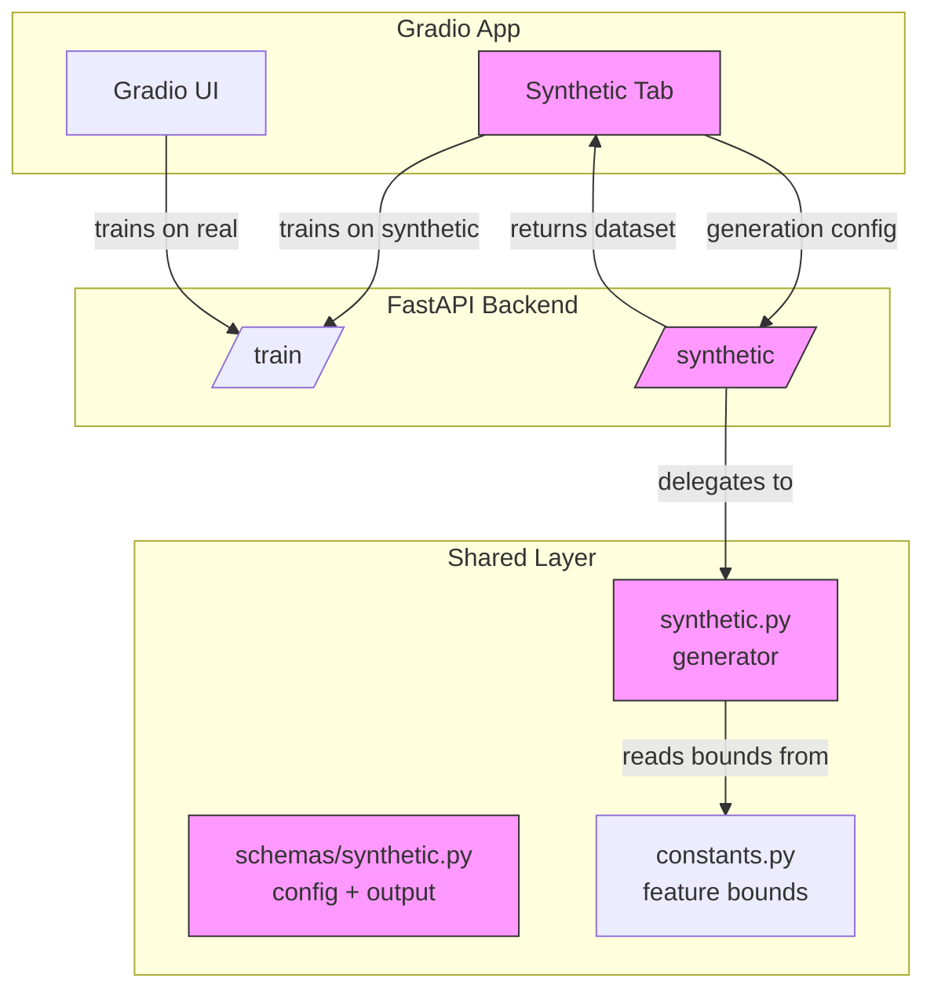

# RFC-007: Gradio Data Input Strategy — Synthetic Generation over User Uploads

| Field | Value |
|-------|-------|
| Status | Draft |
| Author(s) | pkiage |
| Updated | 2026-02-13 |
| Depends On | [RFC-001](RFC-001-CreditRiskPlatformArchitecture.md), [RFC-002](RFC-002-api-layer.md) |

## Objective

Replace the implicit "bundled-dataset-only" approach in Gradio with an explicit strategy: **no user file uploads**; instead, provide built-in synthetic data generation so stakeholders can explore model behavior across controlled data distributions and compare results against the real reference dataset.

**Goals:**

- Remove any ambiguity about whether Gradio should support CSV uploads
- Provide a synthetic data generator that produces loan application datasets matching the `shared/` schema
- Enable side-by-side comparison of model performance on real vs. synthetic data
- Keep the Gradio app deployable to HuggingFace Spaces without filesystem or security concerns

**Non-goals:**

- Building a general-purpose data generation framework (scope is credit risk loan data only)
- Adding dataset upload to the Next.js web app (separate decision, separate RFC if needed)
- Replacing the real training dataset — synthetic data supplements, not supplants
- Statistical guarantees on synthetic data fidelity (e.g., differential privacy, GAN-based generation)

## Motivation

### Why not add file uploads to Gradio?

The Gradio app (`apps/gradio/`) currently trains models exclusively on the bundled dataset (`data/processed/cr_loan_w2.csv`). There is **no file upload UI and no upload API endpoint**. Adding uploads would introduce:

1. **Security surface** — Arbitrary CSV parsing opens the door to path traversal, CSV injection, and denial-of-service via large files. The Gradio app is designed for HuggingFace Spaces deployment where filesystem access is sandboxed and ephemeral.

2. **Validation complexity** — Uploaded data must match the exact 28-feature schema (7 numeric + 19 one-hot encoded categoricals + 1 target). Users would need to understand internal encoding conventions (`person_home_ownership_RENT`, `loan_grade_B`, etc.) to prepare valid files. This is a poor stakeholder experience.

3. **Scope mismatch** — Gradio's role in the UI progression (Marimo → Gradio → Next.js) is *stakeholder demos*, not data engineering workflows. Upload functionality belongs in Marimo notebooks (developer exploration) or the Next.js app (production workflows with proper auth and validation).

4. **Reproducibility** — Uploaded datasets are ephemeral on HF Spaces. Models trained on uploaded data cannot be reproduced without the original file, breaking the audit trail.

### Why synthetic data?

Stakeholders frequently ask "what if" questions: *What happens if we see more high-income applicants? What if default rates increase? How does the model handle grade F loans?* Today, the only way to explore these scenarios is to modify the CSV manually — which requires developer intervention.

A synthetic data generator would let stakeholders:

- Stress-test models against shifted distributions (e.g., higher default rates, skewed income)
- Understand model sensitivity to specific feature ranges
- Compare model performance on controlled vs. real-world data
- Generate unlimited training data for quick iteration without touching production datasets

## User Benefit

**Release notes:** "Generate synthetic loan datasets directly in the Gradio app. Explore model behavior under custom distributions and compare performance against the real reference dataset — no file uploads needed."

## Design Proposal

### System Context



Pink nodes are new components introduced by this RFC.

### Overview

The design adds three components:

1. **`shared/logic/synthetic.py`** — A pure-numpy synthetic data generator that produces loan datasets conforming to the existing schema. Uses `constants.py` bounds for realistic value ranges.

2. **`POST /synthetic/generate`** — A new API endpoint that accepts a generation config and returns a dataset (or stores it for training).

3. **Gradio "Synthetic Data" tab** — UI controls for distribution parameters, generation trigger, preview, and "Train on Synthetic" workflow.

### Key Design Decisions

#### 1. Generator lives in `shared/`, not in Gradio or API

**Why:** The generator is pure business logic (numpy + schema validation). Placing it in `shared/logic/` lets Marimo notebooks and the API reuse it. This follows the existing pattern where `threshold.py`, `evaluation.py`, and `feature_selection.py` all live in `shared/logic/`.

#### 2. Parametric generation, not GAN/ML-based

**Why:** A parametric generator (controlled distributions per feature) is transparent, reproducible, and has zero additional dependencies. Stakeholders can reason about what changed ("I increased default rate to 40%") without understanding generative models. ML-based synthetic data (SDV, CTGAN) would add heavy dependencies, training time, and opacity — all non-goals for a demo tool.

#### 3. No raw CSV upload at any layer

**Why:** See Motivation. The API already accepts structured `TrainingConfig` objects. Synthetic data flows through the same typed pipeline — generated in-memory, validated against Pydantic schemas, and passed directly to `train_model()`. No filesystem round-trip needed.

#### 4. Comparison as a first-class workflow

**Why:** The primary value of synthetic data isn't training better models — it's *understanding* model behavior. The design prioritizes the comparison workflow: train on real data, train on synthetic data, compare metrics side-by-side using the existing Comparison tab.

### API / Interface Changes

#### New schema: `shared/schemas/synthetic.py`

```python
class SyntheticDistribution(BaseModel):
    """Per-feature distribution overrides."""
    feature: str
    mean_shift: float = 0.0       # Shift mean by this factor (1.0 = no change)
    std_scale: float = 1.0        # Scale std deviation
    # Categorical features use probability weights instead
    category_weights: dict[str, float] | None = None

class SyntheticConfig(BaseModel):
    """Configuration for synthetic dataset generation."""
    n_samples: int = Field(default=5000, ge=100, le=50000)
    default_rate: float = Field(default=0.22, ge=0.01, le=0.99)
    distributions: list[SyntheticDistribution] = []
    random_seed: int | None = 42

class SyntheticDataset(BaseModel):
    """Generated synthetic dataset metadata."""
    n_samples: int
    n_features: int
    default_rate_actual: float
    feature_names: list[str]
    summary_stats: dict[str, dict[str, float]]  # feature → {mean, std, min, max}
```

#### New endpoint: `POST /synthetic/generate`

```python
@router.post("/synthetic/generate/", response_model=SyntheticGenerateResponse)
async def generate_synthetic(config: SyntheticConfig) -> SyntheticGenerateResponse:
    """Generate a synthetic dataset and optionally train a model on it."""
    ...
```

Returns a `dataset_id` that can be referenced in subsequent `/train/` calls via a new optional `dataset_id` field on `TrainingConfig`.

#### Modified schema: `TrainingConfig`

```python
class TrainingConfig(BaseModel):
    model_type: str
    test_size: float = 0.2
    # ... existing fields ...
    dataset_id: str | None = None  # If set, train on this synthetic dataset
```

### Data Storage

Synthetic datasets are held **in-memory only** (same pattern as the existing model store). They are ephemeral by design — stakeholders generate, explore, and discard. No filesystem persistence needed.

A simple dict store keyed by `dataset_id`:

```python
# apps/api/services/synthetic_store.py
_datasets: dict[str, tuple[NDArray, NDArray, list[str]]] = {}
```

Datasets auto-expire after 1 hour or when the server restarts. A maximum of 10 datasets can be held simultaneously to bound memory usage.

### Usage Examples

#### Gradio workflow

1. User opens the **Synthetic Data** tab
2. Adjusts sliders: `n_samples=10000`, `default_rate=0.35`, increases `loan_int_rate` mean by 20%
3. Clicks **Generate** → sees preview table with summary statistics
4. Clicks **Train on Synthetic** → trains a logistic regression model
5. Switches to **Training** tab → trains same model type on real data
6. Opens **Comparison** tab → selects both models → sees side-by-side metrics and ROC curves

#### API workflow

```bash
# Generate synthetic dataset
curl -X POST /synthetic/generate/ \
  -d '{"n_samples": 5000, "default_rate": 0.35}'

# Train on synthetic
curl -X POST /train/ \
  -d '{"model_type": "logistic_regression", "dataset_id": "syn_abc123"}'

# Train on real (existing behavior, unchanged)
curl -X POST /train/ \
  -d '{"model_type": "logistic_regression"}'

# Compare both
curl -X POST /models/compare/ \
  -d '{"model_ids": ["lr_real_abc", "lr_syn_def"]}'
```

#### Marimo notebook workflow

```python
from shared.logic.synthetic import generate_synthetic_dataset
from shared.schemas.synthetic import SyntheticConfig

config = SyntheticConfig(n_samples=10000, default_rate=0.4)
X, y, feature_names = generate_synthetic_dataset(config)
# Use directly with shared/logic/evaluation.py, threshold.py, etc.
```

## Alternatives Considered

### Alternative 1: Add CSV upload to Gradio

**Description:** Add a `gr.File` upload component to allow users to upload their own datasets.

**Pros:** Maximum flexibility; users can bring any dataset.

**Cons:** Security risks (arbitrary file parsing), validation burden (must match 28-column schema with exact naming), poor UX for non-technical stakeholders, breaks audit trail on HF Spaces, doesn't address "what if" scenarios.

**Why not chosen:** Misaligns with Gradio's role as a stakeholder demo tool. Upload workflows belong in Marimo (developer) or Next.js (production with auth).

### Alternative 2: Preset scenario library (no custom generation)

**Description:** Ship 3-5 pre-built synthetic datasets (e.g., "High Default Rate", "Young Borrowers", "Premium Loans") as static CSVs.

**Pros:** Zero generation logic needed; simple to implement; guaranteed valid data.

**Cons:** Not interactive — stakeholders can't explore custom scenarios. Adding new scenarios requires code changes. Doesn't scale to combinatorial exploration.

**Why not chosen:** Too rigid. The parametric generator achieves the same presets via saved configs while allowing unlimited customization.

### Alternative 3: ML-based synthetic data (CTGAN / SDV)

**Description:** Train a generative model on the real dataset and sample from it to create synthetic data that matches real-world correlations.

**Pros:** Preserves feature correlations and joint distributions; more statistically faithful.

**Cons:** Adds `sdv` or `ctgan` as heavy dependencies (~500MB+); requires training a generative model (slow); output is opaque to stakeholders; privacy implications if deployed publicly (synthetic data can leak real patterns).

**Why not chosen:** Over-engineered for the use case. Stakeholders want *controlled* distribution shifts, not faithful replicas. Parametric generation is transparent, fast, and dependency-free.

## Dependencies

- **New dependencies:** None. Generator uses numpy (already a transitive dependency via sklearn) and existing Pydantic schemas.
- **Dependent projects:** `apps/gradio/` (new tab), `apps/api/` (new endpoint), `notebooks/` (can import generator)

## Engineering Impact

- **Maintenance:** Owned by the same team maintaining `shared/logic/`. Generator is ~150-200 lines of numpy code.
- **Testing:** Unit tests for generator (distribution properties, schema compliance, edge cases). Integration tests for API endpoint. Gradio tab tested via existing manual QA pattern.
- **Build impact:** None — no new dependencies.
- **API surface:** One new endpoint (`/synthetic/generate/`), one modified schema (`TrainingConfig.dataset_id`).

## Platforms and Environments

- **HuggingFace Spaces:** Fully compatible. In-memory generation, no filesystem writes, bounded memory.
- **Local development:** Works identically.
- **Production (Next.js):** Synthetic generation is available via API but not yet exposed in the web UI (future RFC if needed).

## User Impact

- **User-facing changes:** New "Synthetic Data" tab in Gradio app. All existing functionality unchanged.
- **Migration:** None. The `dataset_id` field on `TrainingConfig` is optional with `None` default — existing API clients are unaffected.

## Implementation Plan

| Phase | Scope | Effort |
|-------|-------|--------|
| 1 | `shared/schemas/synthetic.py` — Pydantic models | Small |
| 2 | `shared/logic/synthetic.py` — Generator + tests | Medium |
| 3 | `apps/api/` — `/synthetic/generate/` endpoint + synthetic store | Medium |
| 4 | `apps/api/` — `TrainingConfig.dataset_id` support in `/train/` | Small |
| 5 | `apps/gradio/` — Synthetic Data tab | Medium |
| 6 | Documentation and notebook example | Small |

## Questions and Discussion Topics

1. **Default rate control granularity** — Should users control the overall default rate only, or also set conditional default rates (e.g., "Grade F loans default at 60%")? Conditional rates add complexity but are more realistic.

2. **Feature correlation preservation** — The parametric generator samples features independently by default. Should we add an option to preserve correlations from the real dataset (e.g., income ↔ loan amount)? This adds complexity but prevents unrealistic combinations.

3. **Preset configs** — Should we ship a handful of named presets ("Stress Test", "Low Default", "Young Borrowers") as convenience shortcuts in the Gradio UI? Easy to add and makes the tab immediately useful without parameter tuning.

4. **Next.js exposure** — Should synthetic generation be exposed in the Next.js web app in this RFC, or deferred to a follow-up? Current recommendation: defer, keep this RFC focused on Gradio.

5. **Memory limits** — The proposed 10-dataset / 1-hour TTL limits are conservative. Should these be configurable via environment variables for different deployment contexts?

---

## Revision History

| Date | Author | Changes |
|------|--------|---------|
| 2026-02-13 | pkiage | Initial draft |
