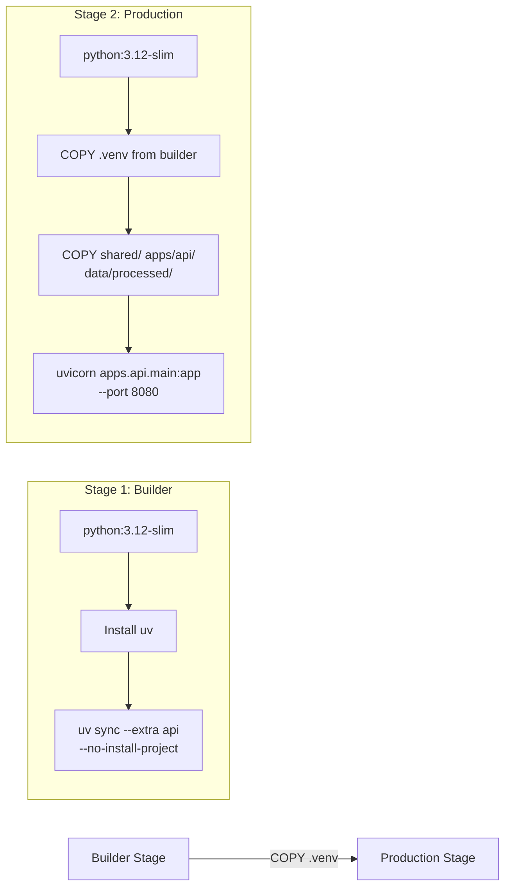
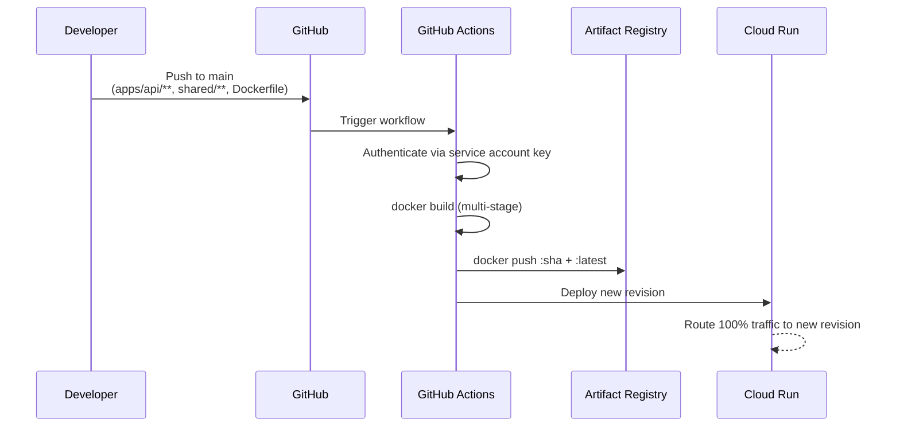

# ADR-009: Cloud Run Deployment

| Field | Value |
|-------|-------|
| Status | Accepted |
| Date | 2026-02-07 |
| PR | [#30](https://github.com/pkiage/tool-credit-risk-modelling/pull/30) |

## Context

The FastAPI backend was initially deployed to [Render](https://render.com) free tier. Training requests (`POST /train/`) consistently timed out due to Render's resource constraints:

| Constraint | Render Free | Requirement |
|------------|-------------|-------------|
| Request timeout | 30 s | 60-120 s (training) |
| RAM | 512 MB | ~800 MB (sklearn + dataset) |
| CPU | Shared | Dedicated during training |
| Cold start | ~30 s | Acceptable |

The training endpoint loads a 2 MB dataset, fits a logistic regression or XGBoost model, computes ROC curves, and returns full metrics JSON (~75 KB). This workload exceeds Render free tier capacity.

## Decision

Migrate the FastAPI backend to **Google Cloud Run** with a multi-stage Docker build and GitHub Actions CI/CD.

### Infrastructure

| Component | Service | Purpose |
|-----------|---------|---------|
| Compute | Cloud Run | Serves API, auto-scales 0-1 |
| Container registry | Artifact Registry | Stores Docker images |
| CI/CD build | Cloud Build | Builds images on push |
| CI/CD deploy | GitHub Actions | Orchestrates build + deploy |

**Cloud Run configuration:**

| Setting | Value | Rationale |
|---------|-------|-----------|
| Memory | 1 GiB | sklearn + pandas + dataset in memory |
| CPU | 1 | Sufficient for single-model training |
| Timeout | 300 s | 5 min ceiling for training requests |
| Min instances | 0 | Scale to zero (free tier friendly) |
| Auth | `--allow-unauthenticated` | Public API (app-level auth via API keys) |
| Port | 8080 | Cloud Run default |

### Docker Build Strategy

Multi-stage build using `uv` for fast, reproducible dependency installation:

Key details:
- `--no-install-project` skips hatchling build (no `apps/__init__.py`)
- `PYTHONPATH=/app` allows `from apps.api...` and `from shared...` imports
- `data/processed/cr_loan_w2.csv` baked into image (training dataset)
- `artifacts/` directory writable for model persistence (ephemeral per instance)

### CI/CD Pipeline

**Trigger paths** (changes outside these paths do not trigger a deploy):

| Path | Why |
|------|-----|
| `apps/api/**` | API source code |
| `shared/**` | Shared schemas and logic |
| `Dockerfile` | Build definition |
| `pyproject.toml` | Dependency changes |
| `uv.lock` | Locked dependency versions |

Plus `workflow_dispatch` for manual triggers.

### GitHub Secrets

| Secret | Value | Used by |
|--------|-------|---------|
| `GCP_PROJECT_ID` | `credit-risk-api-pkiage` | Workflow env |
| `GCP_SA_KEY` | Service account JSON key | `google-github-actions/auth@v2` |
| `GCP_REGION` | `us-central1` | Image tag + deploy region |
| `CREDIT_RISK_API_URL` | `https://credit-risk-api-76769478393.us-central1.run.app` | HF Spaces Gradio deploy |

### Service Account Roles

The `github-deploy` service account has minimum required permissions:

| Role | Purpose |
|------|---------|
| `roles/run.admin` | Deploy and manage Cloud Run services |
| `roles/artifactregistry.writer` | Push Docker images |
| `roles/iam.serviceAccountUser` | Act as the compute service account |

### Free Tier Budget

| Resource | Free Tier Allowance | Expected Usage |
|----------|---------------------|----------------|
| Cloud Run requests | 2M / month | < 1K / month |
| Cloud Run vCPU | 180,000 s / month | < 500 s / month |
| Cloud Run memory | 360,000 GiB-s / month | < 1,000 GiB-s / month |
| Artifact Registry | 500 MB | ~400 MB (1 image) |
| Cloud Build | 120 min / day | < 5 min / deploy |

## Alternatives Considered

- **Render (paid tier, $7/mo)** — Solves timeout but adds recurring cost; Cloud Run free tier is more generous
- **Railway ($5/mo)** — Similar to Render, requires paid plan for adequate resources
- **Fly.io (free tier)** — 256 MB RAM free VMs insufficient; 1 GB requires paid plan
- **AWS Lambda + API Gateway** — Cold starts problematic for sklearn model loading (~10 s); 15-min timeout is generous but Lambda packaging is complex for scipy/sklearn
- **Hugging Face Spaces (Gradio backend)** — Already used for Gradio frontend; running FastAPI in a Space is unsupported and fragile
- **Pre-train and serve only** — Eliminates training timeout but removes the interactive training demo, which is a core feature

## Consequences

- API cold starts take ~5-10 s (scale-to-zero trade-off for free tier)
- Model artifacts are ephemeral (lost on new revision deploy); this is acceptable since models are demo-scoped, not production
- `data/processed/cr_loan_w2.csv` is baked into the Docker image; dataset changes require a redeploy
- Billing account required even for free tier (credit card on file, not charged)
- The Gradio app on HF Spaces connects to Cloud Run via `CREDIT_RISK_API_URL` secret; URL changes require re-deploying the Gradio workflow
- Future upgrade path: add `--min-instances=1` to eliminate cold starts (exits free tier, ~$15/mo)
