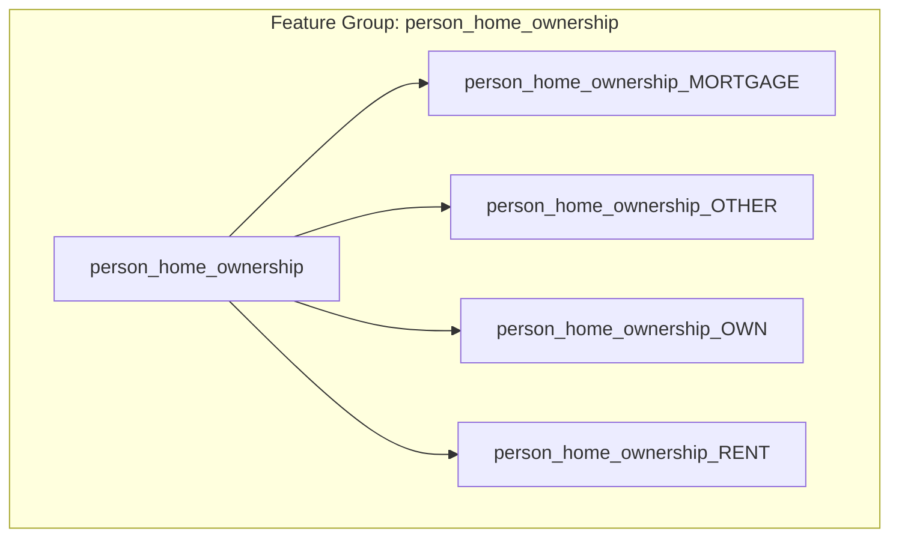

# ADR-010: Training Feature Selection

| Field | Value |
|-------|-------|
| Status | Accepted |
| Author | Paul / Claude |
| Date | 2026-02-07 |
| PR | [#31](https://github.com/pkiage/tool-credit-risk-modelling/pull/31) |

## Context

Previously, all 26 encoded features (7 numeric + 19 one-hot from 4 categorical groups) were always used for training. Users had no way to:

1. Exclude potentially leaky features (e.g. `loan_grade`, which is derived from other applicant data)
2. Assess which features are informative via importance scores
3. Experiment with feature subsets to understand model behavior

### Feature Inventory

| Group | Label | Type | Encoded Columns |
|-------|-------|------|-----------------|
| `person_age` | Age | numeric | 1 |
| `person_income` | Income | numeric | 1 |
| `person_emp_length` | Employment Length | numeric | 1 |
| `loan_amnt` | Loan Amount | numeric | 1 |
| `loan_int_rate` | Interest Rate | numeric | 1 |
| `loan_percent_income` | Loan % of Income | numeric | 1 |
| `cb_person_cred_hist_length` | Credit History Length | numeric | 1 |
| `person_home_ownership` | Home Ownership | categorical | 4 (MORTGAGE, OTHER, OWN, RENT) |
| `loan_intent` | Loan Intent | categorical | 6 (DEBTCONSOLIDATION, EDUCATION, ...) |
| `loan_grade` | Loan Grade | categorical | 7 (A through G) |
| `cb_person_default_on_file` | Previous Default | categorical | 2 (Y, N) |
| | | **Total** | **26** |

## Decision

### API Layer

Add `selected_features: list[str] | None` to `TrainingConfig`:

```python
selected_features: list[str] | None = Field(
    default=None,
    description="Encoded column names to train on. None = all features.",
)
```

- `None` (default) = train on all 26 features (backward compatible)
- Explicit list = train on only those encoded column names

The API operates at the **encoded column** level, providing maximum granularity.

### Feature Groups Abstraction

`shared/constants.py` provides `FEATURE_GROUPS` mapping group names to their encoded columns:



This allows UIs to present category-level toggles while sending column-level selections to the API.

### Gradio UI

```
Feature Selection
├── [✓] Numeric Features (CheckboxGroup)
│   ├── Age, Income, Employment Length, ...
├── ▼ Home Ownership (Accordion)
│   ├── [✓] Select All
│   └── [✓] MORTGAGE  [✓] OTHER  [✓] OWN  [✓] RENT
├── ▼ Loan Intent (Accordion)
│   ├── [✓] Select All
│   └── [✓] DEBTCONSOLIDATION  [✓] EDUCATION  ...
├── ▼ Loan Grade (Accordion)
│   ├── [✓] Select All
│   └── [✓] A  [✓] B  [✓] C  [✓] D  [✓] E  [✓] F  [✓] G
└── ▼ Previous Default (Accordion)
    ├── [✓] Select All
    └── [✓] N  [✓] Y
```

- **Category-level**: checking/unchecking Select All toggles all one-hot columns
- **Column-level**: individual one-hot columns can be independently toggled
- Select All checkbox syncs bidirectionally: unchecking any column unchecks Select All; checking all columns re-checks it
- Uses `.input()` for Select All to prevent event loops (fires only on user interaction, not programmatic updates)

### Feature Importance

Feature importance is now extracted for **all** model types:

| Model | Source | Metric |
|-------|--------|--------|
| XGBoost | `feature_importances_` | Gain-based importance |
| Random Forest | `feature_importances_` | Mean decrease in impurity |
| Logistic Regression | `abs(coef_[0])` | Absolute coefficient magnitude |

Displayed as a horizontal bar chart sorted by importance.

### Model ID Format

Updated to include feature count for traceability:

```
{model_type}_test{pct}_{n_features}f_{uuid6}
```

Examples:
- `logistic_regression_test20_26f_a1b2c3` (all features)
- `xgboost_test20_19f_d4e5f6` (subset, e.g. without loan grade)

### Prediction-Time Feature Subsetting

Models trained on a feature subset store their `feature_columns` in the model store. At prediction time, the inference service:

1. Creates the full 26-element feature vector from the loan application
2. Selects only the columns the model was trained on (via stored indices)
3. Passes the subsetted vector to `model.predict_proba()`

## Files Modified

| File | Change |
|------|--------|
| `shared/constants.py` | `FEATURE_GROUPS`, `ALL_FEATURE_GROUPS`, `FEATURE_GROUP_LABELS` |
| `shared/schemas/training.py` | `selected_features` field on `TrainingConfig` |
| `apps/api/services/training.py` | Feature subsetting in `load_dataset_from_csv`, LR importance, model ID format |
| `apps/api/services/model_store.py` | `feature_columns` storage and retrieval |
| `apps/api/services/inference.py` | Feature-filtered predictions |
| `apps/gradio/components/training_tab.py` | Feature selection UI + importance chart |

## Alternatives Considered

- **Feature selection via separate endpoint** — More RESTful but adds complexity; embedding in `TrainingConfig` is simpler and keeps selection tied to the training run
- **Group-level API (`selected_groups`)** — Simpler API but loses the ability to exclude individual one-hot columns (e.g. include `loan_grade_A` through `loan_grade_E` but exclude `F` and `G`)
- **Automatic feature selection (RFE, LASSO)** — Valuable but orthogonal; users should first be able to manually select features before adding automated methods
- **Store feature columns in ModelMetadata schema** — Would require schema migration; storing in model store dict is simpler and doesn't affect API contract

## Consequences

- All existing API clients and tests remain backward compatible (`selected_features: None`)
- Users can now exclude leaky features like `loan_grade` to build more realistic models
- Feature importance chart helps users make informed feature selection decisions
- Logistic regression now returns importance (previously only tree models did)
- Model ID is now longer but more informative
- Prediction service has a small overhead for column index lookup (negligible)
