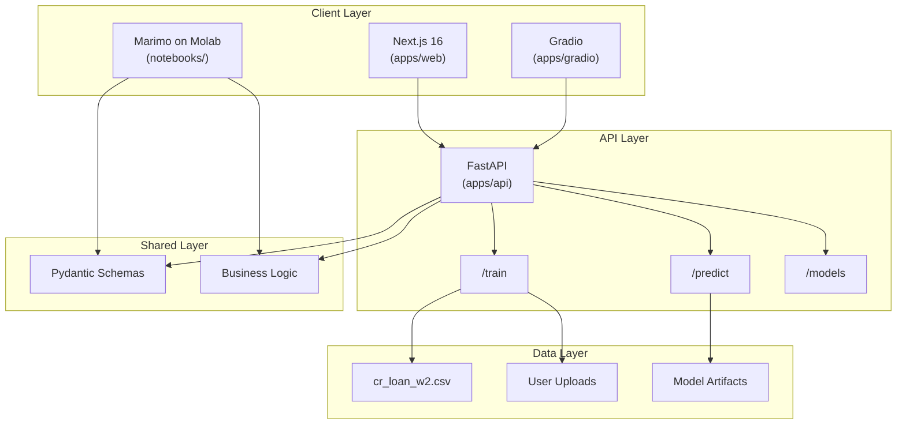
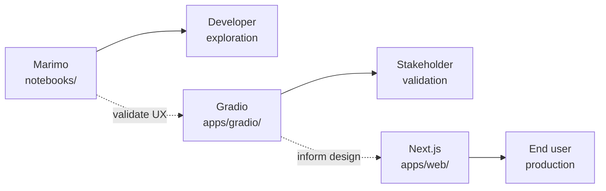

# RFC-001: Credit Risk Modeling Platform Architecture

| Field | Value |
|-------|-------|
| Status | Draft |
| Author(s) | Claude |
| Updated | 2025-01-30 |
| GitHub Issue | — |
| Obsoletes | — |

## Objective

Migrate the existing Streamlit-based credit risk modeling demo to a production-grade monorepo with clear separation between API (FastAPI), UI layers (Marimo → Gradio → Next.js), and shared business logic.

**Goals:**

- Single source of truth for schemas and ML logic in `shared/`
- Interactive learning via Marimo notebooks deployable to Molab
- Stakeholder demos via Gradio on HF Spaces
- Production UI via Next.js with typed API integration
- Audit trail for model training and predictions

**Non-goals:**

- Distributed model serving (single-instance API is sufficient)
- Real-time streaming predictions
- Multi-tenant authentication (demo-level auth only)

## Motivation

The current implementation scored 3.2/10 in technical assessment due to:

- Zero test coverage — bugs discovered only in production
- No error handling — crashes on malformed input
- Hard-coded paths — Windows-specific, non-portable
- Deprecated APIs — `@st.cache` instead of `@st.cache_data`
- No separation of concerns — ML logic entangled with UI

**Who is affected:**

- Developers cannot safely refactor without tests
- Stakeholders see crashes during demos
- Users cannot run locally without Windows + Graphviz path hacks

**Current pain points:**

- Adding a new model requires touching UI code
- Threshold optimization logic duplicated across views
- No way to persist or serve trained models

## User Benefit

**Release notes headline:** "Credit risk models now trainable via API, comparable in interactive notebooks, and deployable to production."

Concrete benefits:

- Train and compare models without writing code (Gradio/Next.js UI)
- Explore threshold optimization interactively (Marimo notebooks)
- Integrate predictions into external systems (FastAPI endpoints)
- Audit model decisions for compliance review

## Design Proposal

### Overview

Three-tier architecture with progressive UI fidelity:

```
┌─────────────────────────────────────────────────────────────┐
│                        UI Layer                             │
│  Marimo (explore) → Gradio (validate) → Next.js (ship)      │
└─────────────────────────────────────────────────────────────┘
                              │
                              ▼
┌─────────────────────────────────────────────────────────────┐
│                       API Layer                             │
│              FastAPI (apps/api/)                            │
│         /train  /predict  /models  /health                  │
└─────────────────────────────────────────────────────────────┘
                              │
                              ▼
┌─────────────────────────────────────────────────────────────┐
│                     Shared Layer                            │
│    Pydantic Schemas + Business Logic (shared/)              │
│    LoanApplication, TrainingConfig, Youden's J, etc.        │
└─────────────────────────────────────────────────────────────┘
                              │
                              ▼
┌─────────────────────────────────────────────────────────────┐
│                      Data Layer                             │
│         cr_loan_w2.csv | User Uploads | Artifacts           │
└─────────────────────────────────────────────────────────────┘
```

### System Architecture (Mermaid)



### UI Layer Progression



### API / Interface Changes

#### Endpoints

| Method | Path | Request | Response |
|--------|------|---------|----------|
| `POST` | `/train` | `TrainingConfig` + file | `TrainingResult` |
| `POST` | `/predict` | `PredictionRequest` | `PredictionResponse` |
| `GET` | `/models` | — | `list[ModelSummary]` |
| `POST` | `/models/{id}/persist` | — | `{path, instructions}` |
| `GET` | `/health` | — | `{status: "ok"}` |

#### Core Schemas

```python
# shared/schemas/loan.py
class LoanApplication(BaseModel):
    person_age: int = Field(ge=18, le=120)
    person_income: float = Field(gt=0)
    person_emp_length: float = Field(ge=0)
    loan_amnt: float = Field(gt=0)
    loan_int_rate: float = Field(gt=0, le=100)
    loan_percent_income: float = Field(ge=0, le=1)
    cb_person_cred_hist_length: int = Field(ge=0)
    person_home_ownership: Literal["RENT", "OWN", "MORTGAGE", "OTHER"]
    loan_intent: Literal["EDUCATION", "MEDICAL", "VENTURE", "PERSONAL", "DEBTCONSOLIDATION", "HOMEIMPROVEMENT"]
    loan_grade: Literal["A", "B", "C", "D", "E", "F", "G"]
    cb_person_default_on_file: Literal["Y", "N"]

# shared/schemas/training.py
class TrainingConfig(BaseModel):
    model_type: Literal["logistic_regression", "xgboost", "random_forest"]
    test_size: float = Field(default=0.2, ge=0.1, le=0.5)
    random_state: int = 42

class TrainingResult(BaseModel):
    model_id: str
    metrics: ModelMetrics
    optimal_threshold: float
    feature_importance: dict[str, float] | None

# shared/schemas/metrics.py
class ThresholdResult(BaseModel):
    threshold: float
    sensitivity: float  # TPR
    specificity: float  # TNR
    youden_j: float

class ModelMetrics(BaseModel):
    accuracy: float
    precision: float
    recall: float
    f1_score: float
    roc_auc: float
    threshold_analysis: ThresholdResult
    roc_curve: dict
    confusion_matrix: list[list[int]]
```

### Directory Structure

```
/
├── apps/
│   ├── web/                    # Next.js 16 (App Router)
│   ├── api/                    # FastAPI
│   └── gradio/                 # Gradio (HF Spaces)
├── shared/                     # Single Source of Truth
│   ├── schemas/                # Pydantic models
│   └── logic/                  # Business logic (threshold, evaluation)
├── notebooks/                  # Marimo (.py files)
├── data/raw/                   # cr_loan_w2.csv
├── tests/
├── docs/
│   ├── RFCs/
│   └── ADRs/
├── pyproject.toml
├── package.json
└── CLAUDE.md
```

### Usage Examples

**Training via API:**

```bash
curl -X POST http://localhost:8000/train \
  -H "Content-Type: application/json" \
  -d '{"model_type": "xgboost", "test_size": 0.2}'
```

**Prediction via API:**

```bash
curl -X POST http://localhost:8000/predict \
  -H "Content-Type: application/json" \
  -d '{"applications": [{"person_age": 25, ...}]}'
```

**Interactive exploration (Marimo):**

```bash
marimo run notebooks/02_model_comparison.py
```

## Alternatives Considered

### Alternative 1: Refactor Streamlit in place

**Pros:** Faster initial progress, familiar to current users

**Cons:** Still tied to Streamlit's limitations, no API layer, can't serve models

**Why not chosen:** Doesn't address core architectural issues; tech debt remains

### Alternative 2: Full Next.js + tRPC

**Pros:** Type-safe end-to-end, single language (TypeScript)

**Cons:** Loses Python ML ecosystem, harder to iterate on model logic

**Why not chosen:** Credit risk modeling benefits from Python's ML libraries

### Alternative 3: Jupyter + Voila

**Pros:** Familiar notebook paradigm

**Cons:** Poor git diffs, no typed schemas, limited interactivity

**Why not chosen:** Marimo offers better DX with .py files and reactive cells

## Dependencies

**New dependencies:**

- `uv` — Python package management
- `pydantic>=2.0` — Schema validation
- `fastapi` — API framework
- `marimo` — Interactive notebooks
- `gradio` — Stakeholder demos

**Dependent projects:**

- HF Spaces deployment (Gradio)
- Molab deployment (Marimo)
- Vercel deployment (Next.js)

## Engineering Impact

**Maintenance:** Shared logic owned by ML team; UI layers owned by respective teams

**Testing:**

- `shared/` — 90%+ coverage required
- `apps/api/` — Integration tests for all endpoints
- `apps/web/` — Component tests + E2E

**Build impact:** Monorepo with `uv` workspaces (Python) and `npm` workspaces (Node)

**API surface:** New public API at `/train`, `/predict`, `/models`

## Platforms and Environments

| Platform | Layer | Notes |
|----------|-------|-------|
| Local | All | `uv run`, `npm run dev` |
| Molab | Marimo | Notebook deployment |
| HF Spaces | Gradio | Docker-based |
| Vercel | Next.js | Edge deployment |
| Any cloud | FastAPI | Containerized |

## Best Practices

- All Pydantic schemas in `shared/` — never define models in app layers
- TypeScript interfaces derived from Pydantic (manual sync or codegen)
- Marimo notebooks import from `shared/`, never duplicate logic
- Audit events for all training and prediction operations

## Tutorials and Examples

- `notebooks/01_eda.py` — Dataset exploration
- `notebooks/02_model_comparison.py` — Train and compare models
- `notebooks/03_threshold_optimization.py` — Youden's J walkthrough
- `docs/` — API usage examples

## User Impact

**User-facing changes:**

- New API endpoints for programmatic access
- New Gradio UI for stakeholder demos
- New Next.js UI (replaces Streamlit)

**Migration:**

- Existing Streamlit users redirect to new UI
- No data migration required (stateless)

## Detailed Design

See inline code examples above. Full implementation in:

- `shared/schemas/` — All Pydantic models
- `shared/logic/threshold.py` — Youden's J implementation
- `apps/api/routers/` — FastAPI endpoints

## Questions and Discussion Topics

### 1. Model persistence backend — Local filesystem, S3, or MLflow?

**Decision: Local filesystem now, evaluate MLflow for Phase 5.**

- The `POST /models/{id}/persist` endpoint already writes pickle + JSON metadata to `artifacts/`. This is the right choice for Phases 2-4: zero infrastructure dependencies, easy to inspect, and sufficient for single-instance deployment.
- S3 is premature — it adds a cloud dependency, credential management, and network latency for a single-user demo tool. If deployment targets require it later, swapping the storage backend behind `model_store.py` is straightforward.
- MLflow is the strongest Phase 5 candidate. It provides model versioning, experiment tracking, and a model registry — all things the platform will eventually need. But it's a heavy dependency to introduce before there's a clear multi-user or experiment-comparison requirement. Evaluate when the Marimo notebook layer is complete and users are comparing multiple model runs.
- Pickle is acceptable for Phase 2 artifacts since models are only loaded by trusted code. Phase 5 should migrate to `joblib` (faster for numpy-heavy objects) or ONNX (portable, language-agnostic).

### 2. Auth strategy — None for demo, API key, or OAuth?

**Decision: None for Phases 2-3. API key for Phase 4. OAuth if multi-tenant is ever needed.**

- The RFC explicitly lists multi-tenant auth as a non-goal. Adding auth now would slow down iteration on the core ML workflows (Marimo, Gradio, Next.js) without protecting anything valuable — the API is local-only and trains on a bundled demo dataset.
- Phase 4 (when Next.js ships): add a simple API key via `X-API-Key` header, validated in a FastAPI dependency. This is a ~20-line change: one `Settings` field, one `Depends()` function, one middleware. It's enough to prevent accidental public exposure if deployed behind a URL.
- OAuth/OIDC is only justified if the platform becomes multi-tenant (multiple users, per-user model storage, RBAC). The RFC says this is a non-goal, so don't build toward it unless requirements change.
- When auth is added, lock down CORS origins at the same time (see RFC-002 Q3).

### 3. Chart library for Next.js — Recharts, Plotly.js, or Nivo?

**Decision: Recharts.**

- The original Streamlit app used Plotly, so there's familiarity with its chart types. However, for Next.js the tradeoffs shift:
  - **Recharts** — Built on React primitives (SVG components), tree-shakeable, small bundle (~45KB gzipped for typical usage), composable API that feels native in JSX. Best fit for a React-first codebase. Handles the needed chart types well: ROC curves (line), confusion matrices (heatmap/table), feature importance (bar), calibration curves (line).
  - **Plotly.js** — Full-featured but heavy (~1MB min bundle even with partial imports). The `react-plotly.js` wrapper is a thin shim over the imperative Plotly API, not a React-native experience. Overkill for the 4-5 chart types this app needs.
  - **Nivo** — Beautiful defaults, good for dashboards, but its API is more opinionated and less composable than Recharts. Smaller community and fewer escape hatches for custom interactions.
- If 3D plots or advanced statistical charts become necessary later, Plotly can be added for specific pages without replacing Recharts globally.

### 4. TypeScript sync — Manual or `datamodel-code-generator`?

**Decision: `datamodel-code-generator` with manual review.**

- The `shared/schemas/` layer now has 17 Pydantic models across 6 files. Manual translation to TypeScript interfaces is error-prone and will drift as schemas evolve — this is exactly the problem the shared layer was built to prevent.
- `datamodel-code-generator` reads Pydantic models (via JSON Schema export) and generates TypeScript interfaces. Run it as a CI check or pre-commit hook: `datamodel-codegen --input-file-type jsonschema --output apps/web/src/types/generated.ts`.
- The "with manual review" qualifier matters: generated types should be committed to git (not generated at build time) so that diffs are visible in PRs. A developer reviews the generated output for correctness before merging, especially for union types and optional fields where codegen can produce surprising results.
- Alternative considered: `pydantic-to-typescript` — less maintained and doesn't support Pydantic v2 well. `datamodel-code-generator` has active maintenance and Pydantic v2 support.

### 5. Gradio placement — Standalone HF Space or embedded in Next.js?

**Decision: Standalone HF Space.**

- Gradio's purpose in this architecture is stakeholder validation — showing non-technical users (risk officers, product managers) the model behavior before the Next.js UI is ready. These users should get a direct URL they can bookmark and revisit, not a page buried inside a developer-facing Next.js shell.
- HF Spaces provides free hosting, zero-config deployment (Dockerfile or `app.py`), and a shareable URL. The Gradio app imports from `shared/` and calls the FastAPI API — it's a thin client, not a separate backend.
- Embedding Gradio in Next.js via iframe is possible but creates a worse experience: inconsistent styling, iframe resizing issues, and a confusing navigation model where part of the app is React and part is Gradio.
- The two UIs serve different audiences and have different lifecycles. Gradio can be iterated on quickly for stakeholder feedback while Next.js is being built. Once Next.js ships, the Gradio app becomes a secondary demo tool (conferences, HF community) rather than the primary UI.

---

## Revision History

| Date | Author | Changes |
|------|--------|---------|
| 2025-01-30 | Claude | Initial draft |
